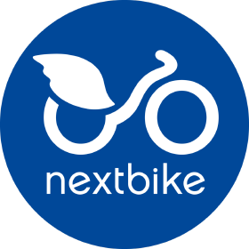
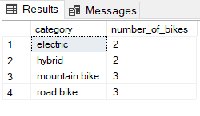
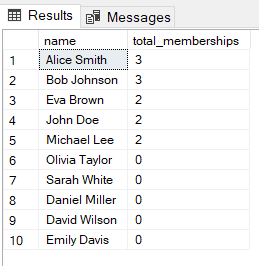
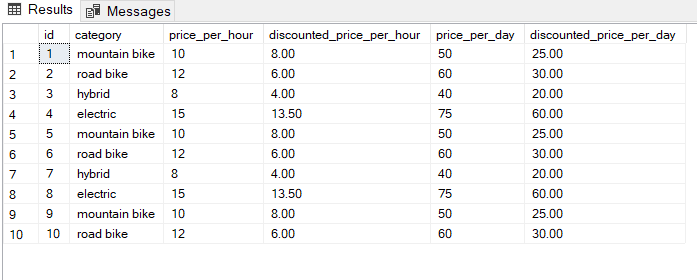
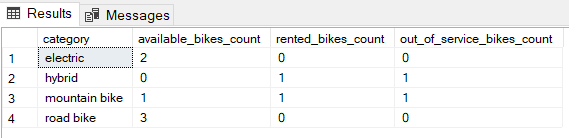
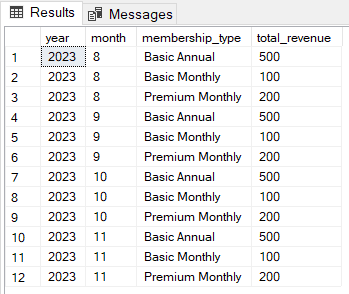
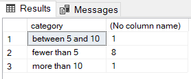
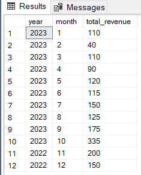

# 🚴‍♂️ NextBike Bike Rentals – Database Documentation
<p align="center">
  
</p>

## 📊 Overview
NextBike Rentals is a modern and customer-centric bike rental platform designed to offer flexible, affordable, and accessible transportation solutions. Whether it's a one-hour ride around the city or a month-long adventure, NextBike enables users to choose from a wide range of bikes and tailored membership plans.
This project aims to design a robust and scalable database system that efficiently handles core business operations such as bike inventory management, customer tracking, rental transactions, and subscription memberships.

---

## 🧱 Database Schema Overview

### 1. 🧍 `Customer`
Stores details of all customers.

| Column        | Data Type | Description             |
|---------------|-----------|-------------------------|
| `customer_id` | INT       | Unique ID (PK)          |
| `name`        | TEXT      | Customer's full name    |
| `email`       | TEXT      | Customer's email        |

🔑 **Primary Key**: `customer_id`

---

### 2. 🚲 `Bike`
Information about all bikes available for rent.

| Column           | Data Type | Description                             |
|------------------|-----------|-----------------------------------------|
| `id`             | INT       | Unique Bike ID (PK)                     |
| `model`          | TEXT      | Bike model name                         |
| `category`       | TEXT      | Type (e.g., mountain, road, hybrid)     |
| `price_per_hour` | DECIMAL   | Rental price per hour                   |
| `price_per_day`  | DECIMAL   | Rental price per day                    |
| `status`         | TEXT      | Current availability (e.g., available, rented, maintenance) |

🔑 **Primary Key**: `id`

---

### 3. 📄 `Rental`
Records each bike rental transaction.

| Column           | Data Type | Description                                   |
|------------------|-----------|-----------------------------------------------|
| `id`             | INT       | Unique Rental ID (PK)                         |
| `customer_id`    | INT       | Linked to `Customer.customer_id` (FK)        |
| `bike_id`        | INT       | Linked to `Bike.id` (FK)                      |
| `start_timestamp`| TIMESTAMP | When the rental started                       |
| `duration`       | INT       | Duration in hours or days (based on pricing) |
| `total_paid`     | DECIMAL   | Total amount paid                             |

🔑 **Primary Key**: `id`  
🔗 **Foreign Keys**:  
- `customer_id → Customer.customer_id`  
- `bike_id → Bike.id`

---

### 4. 🏷️ `Membership_Type`
Defines different subscription plans.

| Column      | Data Type | Description                       |
|-------------|-----------|-----------------------------------|
| `id`        | INT       | Unique Type ID (PK)               |
| `name`      | TEXT      | Plan name (e.g., Monthly, Annual) |
| `description`| TEXT     | Features and benefits             |
| `price`     | DECIMAL   | Subscription cost                 |

🔑 **Primary Key**: `id`

---

### 5. 💳 `Membership`
Links a customer to a specific membership type.

| Column              | Data Type | Description                                |
|---------------------|-----------|--------------------------------------------|
| `id`                | INT       | Unique Membership ID (PK)                  |
| `membership_type_id`| INT       | Linked to `Membership_Type.id` (FK)        |
| `customer_id`       | INT       | Linked to `Customer.customer_id` (FK)      |
| `start_date`        | DATE      | Start date of membership                   |
| `end_date`          | DATE      | Expiry date                                |
| `total_paid`        | DECIMAL   | Total amount paid                          |

🔑 **Primary Key**: `id`  
🔗 **Foreign Keys**:  
- `membership_type_id → Membership_Type.id`  
- `customer_id → Customer.customer_id`

---

## 🔗 Entity Relationships

- A **Customer** can rent multiple bikes (1-to-many).
- A **Bike** can be rented many times (1-to-many).
- A **Customer** can hold one or more **Memberships**.
- Each **Membership** belongs to a **Membership Type**.

---

## 🧠 Key Analysis Areas

- Track active and historical rentals
- Calculate revenue by customer or time frame
- Identify most/least rented bikes
- Analyze membership profitability and retention
- Determine availability and optimize bike utilization
---

## 📈 Insights and Recommendations

1. Number of bikes owned per category

   

```sql
SELECT category, COUNT(DISTINCT model) AS number_of_bikes 
FROM bike
GROUP BY category;
```

2. Number of memberships purchased by each customer

   

```sql
WITH T1 AS (
    SELECT c.id, name, m.customer_id  
    FROM customer c
    LEFT JOIN membership m ON c.id = m.customer_id
)
SELECT name, SUM(CASE WHEN customer_id IS NOT NULL THEN 1 ELSE 0 END) AS total_memberships 
FROM T1
GROUP BY name
ORDER BY total_memberships DESC;
```

💡 Business Insights:
- Top 50% of Customers Drive All Engagement:Only 5 out of 10 customers have any memberships
- Churn Risk Among Half of Customers: The other 50% have zero memberships, indicating a need for re-engagement or understanding barriers
- High Membership Potential Exists: With the average of top 5 customers holding 2.4 memberships, there’s room to encourage upselling/cross-selling

✅ Business Strategy:
1. Reward High-Value Customers
   - Offer loyalty incentives (e.g., bonus services or discounts) to Alice, Bob, Eva, John, and Michael to retain their interest
   - Use them as brand advocates (testimonials, referrals)
2. Re-Engage Inactive Customers
   - Launch targeted campaigns (e.g., emails or calls) for Olivia, Sarah, Daniel, David, and Emily
   - Offer a limited-time discount or free trial membership to encourage activation
3. Analyze Drop-Off Causes
   - Survey the 0-membership group to understand why they aren’t converting
   - Was it expectations unmet or pricing as a barrier?
4. Introduce Tiered Memberships
   - If not already present, introduce tiers (Basic, Premium, Elite) to appeal to different customer needs and budgets
5. Upsell Opportunities
   - Customers with 2 memberships (Eva, John, Michael) may be open to a third
   - Offer bundle deals or “upgrade to all-access” options

3. ❄️ Winter Sale discounts

   

```sql
SELECT id, category, price_per_hour,
       CASE 
           WHEN category = 'electric' THEN price_per_hour * 0.90
           WHEN category = 'mountain bike' THEN price_per_hour * 0.80
           ELSE price_per_hour * 0.50 
       END AS discounted_price_per_hour,
       price_per_day,
       CASE 
           WHEN category = 'electric' THEN price_per_day * 0.80
           WHEN category = 'mountain bike' THEN price_per_day * 0.50
           ELSE price_per_day * 0.50 
       END AS discounted_price_per_day
FROM bike;
```

💡 Business Insights
- Electric bikes are premium products and are only lightly discounted,  to preserve their perceived value or margin
- Mountain and road bikes are more competitively priced and aggressively discounted — likely to stimulate volume sales/rentals
- Hybrid bikes are the most affordable both pre- and post-discount — good entry-level or family option

✅ Business Strategy:
1. Segmented Marketing
   - Promote road and hybrid bikes as the best-value options for price-conscious customers during the winter sale
   - Position electric bikes as a premium/luxury rental with “exclusive winter savings.”
2. Bundle Discounts
   - Offer multi-hour/day packages: e.g., “Rent for 2 days, get the 3rd free” or “Ride 3 hours for the price of 2.”
   - Encourage upselling (e.g., suggest upgrading to electric for just $X more per day).
3. Use Discounts to Drive Loyalty
   - For customers who rent during the winter sale, offer a discount code or membership for spring rentals.
4. Track Conversion by Category
   - Measure which categories are performing best during the sale
   - If hybrids and road bikes convert well, partial discounts can be maintained post-sale
5. Test Deeper Discounts on Electric Bikes (Optional)
   - If electric bike rentals remain low despite light discounting, test a steeper discount for a limited time to evaluate price elasticity

4. 🚲 Rented vs Available vs Out of service count

   

```sql
SELECT category,
       SUM(CASE WHEN status = 'available' THEN 1 ELSE 0 END) AS available_bikes_count,
       SUM(CASE WHEN status = 'rented' THEN 1 ELSE 0 END) AS rented_bikes_count,
       SUM(CASE WHEN status = 'out of service' THEN 1 ELSE 0 END) AS out_of_service_bikes_count
FROM bike
GROUP BY category;
```

💡 Business Insights
- Hybrid and Mountain Bikes are in demand but under-supplied due to low availability and maintenance issues
- Electric and Road Bikes are idle, possibly overstocked or mismatched to current demand
- Out-of-service rate is high in critical categories:
  - Hybrid: 50% of fleet out of service
  - Mountain Bike: 33% out of service

✅ Business Strategy:
1. Prioritize Repairs
   - Immediately repair hybrid and mountain bikes to restore rental capacity and meet demand
   - Delays here result in lost revenue during active demand
2. Rebalance Inventory
   - Investigate why electric and road bikes have no rentals, is it Pricing too high, Lack of awareness or Customer preferences
3. Promote Idle Inventory
   - Consider discounts or bundles for electric and road bikes to stimulate demand (e.g., "Electric bikes for 20% off")
4.  Customer Feedback Survey
   - Ask current renters why they chose hybrid/mountain bikes and not others
   - Use this to adjust pricing, marketing, and bike mix

5. 💰 Revenue based on year, month and membership type

   

```sql
SELECT YEAR(start_date) AS year, MONTH(start_date) AS month, name AS membership_type, SUM(total_paid) AS total_revenue 
FROM membership_type mt
JOIN membership m ON mt.id = m.membership_type_id
GROUP BY YEAR(start_date), MONTH(start_date), name;
```

💡 Business Insights
- Flat Revenue Indicates Stagnation:
  - Despite a consistent product mix, there’s no growth or seasonality impact
  - Suggests a plateau in membership acquisition or renewals
- Annual Plans Dominate Revenue:
  - Basic Annual membership contributes the bulk of earnings
  - Strong retention, but may limit short-term revenue flexibility
- Premium Monthly Potential:
  - Premium Monthly brings in double the revenue of Basic Monthly
  - This tier likely has a higher price or adoption — ripe for upselling

✅ Business Strategy:
1. Drive Growth Through Campaigns
   - Implement seasonal campaigns or flash sales to encourage new sign-up
   - Especially push in months with historically flat performance like October–November
2. Upsell Monthly to Annual
   - Encourage Basic Monthly members to upgrade to Basic Annual with a discount like “Get 2 months free when switching to annual.”
3. Expand Premium Offerings
   - Consider launching Premium Annual memberships 
   - Offer exclusive perks to increase adoption and monthly revenue uplift
4. Segment & Incentisize Referrals
   - Give current members incentives to refer new ones — especially targeting Premium Monthly upgrades
5. Monitor Churn Behind Flatline
   - Flat revenue could mask equal rates of acquisition and churn
   - Track retention and cancellation rates month over month

6. Customer Segmentation

   

```sql
WITH T1 AS (
    SELECT CASE 
               WHEN COUNT(customer_id) > 10 THEN 'more than 10'
               WHEN COUNT(customer_id) BETWEEN 5 AND 10 THEN 'between 5 and 10'
               ELSE 'fewer than 5' 
           END AS category 
    FROM rental
    GROUP BY customer_id
)
SELECT category, COUNT(category) 
FROM T1
GROUP BY category;
```

💡 Business Insights:
- Majority of Customers are Low-Engagement i.e. 80% (8 out of 10) have fewer than 5 memberships, indicating low utilization or early lifecycle stage
- Very Few High-Value Customers i.e. only 1 customer has more than 10 memberships, suggesting very limited top-tier customer retention or upselling success
- Middle Tier is Nearly Absent i.e. Only 1 customer is in the mid-range (5–10), showing a gap in progression from new to power users

✅ Business Strategy:
1. Engage Low-Utilization Customers
   - Offer personalized emails, discounts, or onboarding help to encourage additional sign-ups
   - Launch a “Try 3 Get 1 Free” campaign to push them into the mid-tier
2. Leverage High-Value Customers
   - Study the behaviors of the 1 high-engagement customer
   - Use their journey to replicate success via testimonials, case studies, or referrals
3. Fix the Funnel Gap
   - Incentivize mid-tier growth through milestone bonuses:“Get exclusive perks when you reach 5 or 10 memberships.”
4. Analyze Drop-Off Reasons
   - Investigate why most customers don’t go beyond 4 memberships
   - Is it lack of awareness? Pricing? Complexity?
   - Use short surveys or customer support touchpoints to gather insights

7. Monthly and Yearly trend analysis

   

```sql
SELECT YEAR(start_timestamp) AS year, MONTH(start_timestamp) AS month, SUM(total_paid) AS total_revenue 
FROM rental
GROUP BY YEAR(start_timestamp), MONTH(start_timestamp)
```

💡 Business Insights
  - Revenue performance is improving in the second half of the year, especially in Q4
  - February is a critical low month, possibly requiring interventions
  - Q3 (Jul–Sep) shows stable, moderate growth — a good base to build mid-year campaigns

✅ Business Strategy:
1. Double Down on Q4 Momentum
   - Launch holiday bundles, referral bonuses, or annual plan incentives in Nov–Dec to capitalize on peak interest
   - Consider pre-selling 2024 annual memberships in December
2. Fix the February Slump
   - Investigate drop causes: Is it weather, marketing inactivity, or service issues?
   - Launch early-season promotions or discounts to stimulate demand
   - Use February for customer re-engagement campaigns (e.g., inactive user emails).
3. Monthly Growth Plan
   - Use data from July–October to forecast and plan budgets and inventory needs.
   - Set a revenue goal for Q1 2024 to exceed Q1 2023’s $260.
4. Capitalize on High Months
   - Introduce premium product trials or upsells during high-traffic months like October and November.
   - Promote longer-term memberships during these peaks to secure future revenue.
5. Track Campaign ROI
   - Crosscheck spikes (e.g., October's 335) with specific actions (marketing, discounts, product launches) and replicate what worked.
---

## 🛠️ SQL Techniques Used

- **Joins**: `INNER`, `LEFT JOIN` across 5+ tables
- **Aggregates**: `SUM()`, `COUNT()`, `AVG()`
- **Case Logic**: `CASE WHEN` used for dynamic labels and segmentation
---

🔑 Key Takeaways
1. Customer Engagement Is Low and Skewed
   - 8 out of 10 customers have fewer than 5 memberships
   - Only 1 high-value customer (>10 memberships)
   - Indicates a wide engagement gap and poor conversion to loyal users
2. Revenue is Stable but Stagnant
   - Monthly revenue (August–November 2023) is flat at $800, with no growth or seasonality influence
   - Basic Annual plans dominate (62.5%) but limit short-term revenue scalability
3. Demand-Inventory Mismatch
   - Electric and road bikes are underutilized (no rentals)
   - Hybrid and mountain bikes are in demand but constrained by out-of-service units
   - High maintenance burden on the most-rented categories
4. Aggressive Discounts Aren't Driving Rentals
   - Hybrid and road bikes have 50% discounts, yet hybrid bikes are unavailable and road bikes have 0 rentals
   - Electric bikes, with minimal discounting, are not being rented, suggesting poor perceived value or lack of marketing
---

## 📜 Conclusion
The analysis reveals a promising upward trend in revenue, especially during Q3 and Q4 of 2023, with October marking the highest monthly revenue. However, customer engagement remains low, with most users having fewer than 5 memberships, and inventory mismatches are limiting the business. To sustain and accelerate growth, the business should focus on increasing customer engagement, optimizing inventory for high-demand categories, and leveraging seasonal peaks through targeted promotions and membership upgrades. Analysing and improvising low-revenue periods like February with proactive campaigns will be key to achieving year-round revenue stability.

