# 📊 Loan Data Analysis using SQL
<p align="center">
  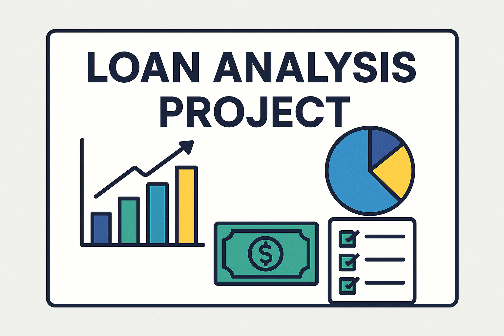
</p>

---

## 🧾 Project Overview

This project involves analyzing loan data stored in a relational database using SQL. The dataset provides insights into borrower characteristics, loan performance, and financial risk indicators. The goal is to derive meaningful business intelligence to assist in credit risk assessment and loan portfolio management.

---

##  Dataset Description

The analysis is performed on a single table with the following columns:

| Column Name             | Description                                                   |
|-------------------------|---------------------------------------------------------------|
| `customer_id`           | Unique identifier for each customer                          |
| `address_state`         | U.S. state where the borrower resides                        |
| `application_type`      | Indicates whether the application is individual or joint     |
| `emp_length`            | Employment length of the borrower (e.g., 10+ years)          |
| `emp_title`             | Job title of the borrower                                    |
| `grade`                 | Loan grade assigned by the lender                            |
| `home_ownership`        | Type of home ownership (Rent, Own, Mortgage)                 |
| `issue_date`            | Date the loan was issued                                     |
| `last_credit_pull_date` | Most recent date a credit check was performed                |
| `last_payment_date`     | Date of last payment received                                |
| `loan_status`           | Current status of the loan (e.g., Fully Paid, Charged Off)   |
| `next_payment_date`     | Upcoming scheduled payment date                              |
| `member_id`             | Internal system identifier                                   |
| `purpose`               | Stated purpose for the loan (e.g., debt consolidation)       |
| `sub_grade`             | More granular sub-grade within the loan grade                |
| `term`                  | Length of the loan (e.g., 36 months, 60 months)              |
| `verification_status`   | Income verification status                                   |
| `annual_income`         | Annual income of the borrower                                |
| `dti`                   | Debt-to-Income ratio                                         |
| `installment`           | Monthly payment amount                                       |
| `int_rate`              | Interest rate of the loan                                    |
| `loan_amount`           | Total loan amount                                            |
| `total_acc`             | Total number of credit accounts                              |
| `total_payment`         | Total amount paid towards the loan                           |

---

## 🔍 Key Analyses Performed

- Loan distribution by **state**, **purpose**, and **grade**
- Analysis of **loan status** trends (e.g., default vs fully paid)
- Comparison of **interest rates** across sub-grades and verification statuses
- **DTI and income correlation** with loan default
- Time-based analysis of **loan issuance** and **payment trends**
- Average and total **loan amounts and installments** by employment length
- Identifying **high-risk borrowers** based on credit history and repayment data

---

## 📈 Insights and Recommendations

1. Total Loan Application

   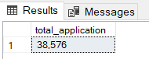

```sql
SELECT FORMAT(COUNT(DISTINCT id),'N0') AS total_application FROM loan;
```

2. Total loan amount disbursed

   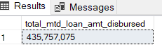

```sql
SELECT FORMAT(SUM(loan_amount),'N0') AS total_disbursed FROM loan;
```

3. MoM increase % in loan application

   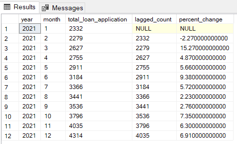

```sql
WITH T1 AS (
  SELECT YEAR(issue_date) AS year, MONTH(issue_date) AS month, COUNT(id) AS total_loan_application,
  LAG(COUNT(id), 1) OVER(ORDER BY MONTH(issue_date)) AS lagged_count
  FROM loan
  GROUP BY YEAR(issue_date), MONTH(issue_date)
)
SELECT *, ROUND((total_loan_application - lagged_count) * 100.0 / lagged_count, 2) AS percent_change FROM T1;
```

Business Insight:
- The loan amount has grown consistently over the year.From $250M in January to $539M in December, amounting to a total increase of ~115%
- Highest Monthly Growth: March saw the largest spike with a +17.15% increase over February
- Other strong growth months: December (+13.04%), November (+6.37%), and May–July (6–7.6%)
- Negative Growth: February was the only month with a decline in loan issuance (-1.53%), possibly due to seasonality or economic factors
- Steady Growth Periods: From April to October, the growth remained positive and stable, indicating consistent demand and strong operational handling

Strategic Recommendation:
1. Investigate March Surge:
  - Analyze marketing campaigns, product launches, or policy changes in Q1 that could explain the March jump
  - Consider replicating effective strategies in Q1 of future years
2. Plan for Q4 Momentum:
  - Q4 (Oct–Dec) has strong, accelerating growth. Launch new loan products or promotions during this time to capitalize on increased demand
3. Mitigate Q1 Dip:
  - Address the February drop proactively through early-year campaigns, partnership promotions, or revised credit terms
4. Monitor Sustainability:
  - With loan volume more than doubling,  credit quality, risk assessment, and customer servicing scale needs to be ensured proportionally
5. Leverage Forecasting:
  - Use this trend data to forecast future monthly disbursements, helping with staffing, budgeting, and cash flow planning

4. MoM increase % in loan disbursement

   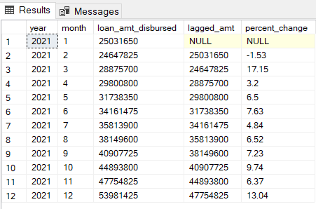

```sql
   WITH T1 AS (
  SELECT YEAR(issue_date) AS year, MONTH(issue_date) AS month, SUM(loan_amount) AS loan_amt_disbursed,
  LAG(SUM(loan_amount), 1) OVER(ORDER BY MONTH(issue_date)) AS lagged_amt
  FROM loan
  GROUP BY YEAR(issue_date), MONTH(issue_date)
)
SELECT *, ROUND((loan_amt_disbursed - lagged_amt) * 100.0 / lagged_amt, 2) AS percent_change FROM T1;
```

Business Insight:
- Strong Upward Trend:Loan disbursement grew from $250.3M in January to $539.8M in December — a 115% increase over the year, indicating expanding demand and operational capacity.
- Top Growth Months: March saw the sharpest spike: +17.15%, indicating seasonal or campaign-driven momentum
- December also performed strongly: +13.04%, possibly reflecting year-end borrowing trends
- October and July also contributed significantly with +9.74% and +4.84% respectively
- Minor Setbacks: February experienced a drop of -1.53%, the only negative month — likely due to seasonal or economic slowdown
- Sustained Growth Periods: Growth was consistent and healthy from April to November, staying within the +3% to +9% range

Business Startegy:
1. Leverage Seasonality Trends
 - March, October, and December are peak periods. Schedule major campaigns, product launches, or rate promotions during these months.
2. Optimize Operational Readiness
 - Prepare for high-disbursement months by: Scaling underwriting and customer support and strengthening fraud checks and risk controls
4. Align disbursed loan growth with application trends (from your earlier image) to understand conversion ratios, loan approval efficiency, bottlenecks in processing
5. Use this data to build a month-wise forecast model to plan: Cash flow, Resource allocation, Product roadmap

4. Total loan amount paid

   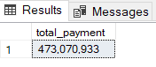

5. MoM increase % in loan amount paid

   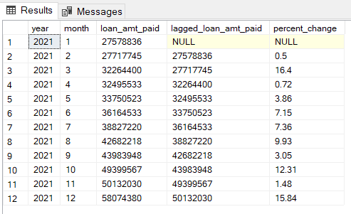

```sql
WITH T1 AS (
  SELECT YEAR(issue_date) AS year, MONTH(issue_date) AS month, SUM(total_payment) AS loan_amt_paid,
  LAG(SUM(total_payment), 1) OVER(ORDER BY MONTH(issue_date)) AS lagged_loan_amt_paid
  FROM loan
  GROUP BY YEAR(issue_date), MONTH(issue_date)
)
SELECT *, ROUND((loan_amt_paid - lagged_loan_amt_paid) * 100.0 / lagged_loan_amt_paid, 2) AS percent_change FROM T1;
```

Business Insight:
- The loan amount paid increased from ~$275M in January to ~$580M in December, marking a 111% increase over the year
- This indicates strong loan repayment activity, possibly due to improved financial conditions, better collection mechanisms, or expanding customer base
- February and April showed minimal change (0.5% and 0.72% respectively)
- June (3.86%) and November (1.48%) were also lower than the annual average
- Except for one small dip in growth rate (June), the loan payments increased month over month, indicating stable and healthy customer repayment behavior

Business Strategy:
1. Capitalize on Year-End Momentum
   - The December spike (+15.84%) suggests borrowers are motivated to pay off loans before the year closes
   - Offer incentives like interest rebates or early payoff discounts in Q4
2. Stimulate early-year payments through:
   - Deferred interest offers for early settlement
   - Tax season tie-ins for Q1 to reduce stagnation like in Feb–April
3. Investigate Mid-Year Slowness
   - Months like April and June saw low repayment growth
   - Analyze whether this is due to seasonal employment, lower income periods, or operational inefficiencies in collections
4. Promote Auto-Debit and Reminders
To ensure repayment consistency, offer auto-pay options, late fee warnings, and SMS/email reminders.

6. Average DTI

   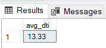

```sql
SELECT ROUND(AVG(dti) * 100.0,2) AS avg_dti FROM loan;
```

7. Percentage of good loan

   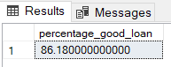

```sql
SELECT 
  ROUND(SUM(CASE WHEN loan_status IN ('Fully Paid', 'Current') THEN 1 ELSE 0 END) * 100.0 / (SELECT COUNT(*) FROM loan),2)
 AS percentage_good_loan FROM loan;
```
8. Amount of good loan disbursed and paid back

   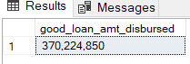
   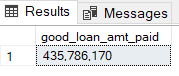
   
Good loan disbursed
```sql
SELECT FORMAT(SUM(loan_amount),'N0') AS good_loan_amt_disbursed FROM loan
WHERE loan_status IN ('Fully Paid', 'Current');
```
Good loan paid back
```sql
SELECT FORMAT(SUM(total_payment),'N0') AS good_loan_amt_paid FROM loan
WHERE loan_status IN ('Fully Paid', 'Current');
```

Business Insights:
- Positive Return from Good Loans
- Interest Earned = $435,786,170 − $370,224,850 = $65,561,320
- This implies that the organization earned over ₹65.56 million from interest alone on good loans

Business Strategy:
- Increase lending to similar borrower profiles to boost profitability
- Offering loyalty benefits or interest rate incentives for early or full repayments will be agood move

9. Amount of bad loan disbursed

   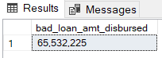
   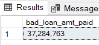

Bad loan disbursed
```sql
SELECT FORMAT(SUM(loan_amount),'N0') AS bad_loan_amt_disbursed FROM loan
WHERE loan_status = 'Charged Off';
```
Bad loan paid back
```sql
SELECT FORMAT(SUM(total_payment),'N0') AS bad_loan_amt_paid FROM loan
WHERE loan_status = 'Charged Off';
```

Business Insights:
- $65.53M disbursed but only $37.28M recovered → Loss of $28.25M
- Recovery Rate: Only 56.9%, which indicates: Weak credit underwriting for bad loans
- Potential issues with collections, borrower quality, or fraud
- Despite the bad loan losses, the portfolio remains overall profitable, due to the strength of good loans

Business Strategy:
- Employ aggressive recovery mechanisms: legal, settlements, restructuring
- Consider insurance coverage or partnerships with collection agencies
- Segment loan performance by geography, borrower type, industry, etc

10. Loan status wise analysis

    

```sql
SELECT loan_status, 
COUNT(id) AS total_loan_application,
FORMAT(SUM(loan_amount),'N0') AS total_funded_amount,
FORMAT(SUM(total_payment),'N0') AS total_amount_received,
ROUND(AVG(int_rate) * 100.0,2) AS avg_interest_rate,
ROUND(AVG(dti) * 100.0,2) AS avg_dti_score
FROM loan
GROUP BY loan_status;
```

Business Insights:
- Fully paid loans are profitable and well-managed. The lower average DTI (Debt-to-Income) suggests stronger financial profiles among these borrowers
- Even though charged-off loans have higher interest rates, the losses are more than potential returns. Borrowers in this segment likely had weaker repayment ability and insufficient screening
- These are high-risk, high-interest loans. Their repayment behavior is yet to be fully seen, but they demand close monitoring due to high DTI

Business strategy:
1. Tighten Credit Underwriting for High DTI Applicants
   - Set stricter approval rules or higher documentation thresholds for applicants with DTI > 13.5
   - Consider using tiered interest rates based on DTI and credit score to manage risk more granularly
2. Revise Pricing Strategy for Charged-Off Segments
   - Reassess whether 13.88% interest adequately compensates for ~43% capital loss.
   - Explore risk-based pricing models or require collateral/security for high-risk profiles.
3. Monitor Current Loans Aggressively
   - Flag and proactively track borrowers with DTI > 14 and interest > 14%
   - Set up early-warning systems for payment delays or behavioral anomalies
4. Invest More in Segments Similar to Fully Paid Borrowers
   - Promote products tailored for low-DTI, low-risk customers
   - Offer incentives for early repayment or loyalty programs to retain strong borrowers

11. Moanthwise loan analysis

    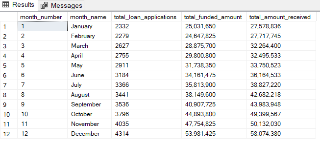

```sql
SELECT 
  MONTH(issue_date) AS month_number,
  DATENAME(MONTH, issue_date) AS month_name,
  COUNT(id) AS total_loan_applications,
  FORMAT(SUM(loan_amount),'N0') AS total_funded_amount,
  FORMAT(SUM(total_payment),'N0') AS total_amount_received
FROM loan
GROUP BY MONTH(issue_date), DATENAME(MONTH, issue_date)
ORDER BY MONTH(issue_date);
```

Business Insights:
- Loan Applications grow steadily from January (2,332) to December (4,314).That’s an 85% increase in applications over the year.
- Funded Amounts rise from ~$25M in January to ~$54M in December.Amount Recovered grows from ~$27.6M to ~$58M over the same period.This shows strong capital deployment and repayment traction.
- Top Performing Months (in Amount Received)
   - December: $58.07M (Highest)
   - November: $50.13M
   - October: $49.40M
 Indicates Q4 is the peak quarter for both disbursals and repayments
- Each month, the amount received exceeds amount funded, which signals: Healthy interest accrual, Consistent repayment behavior, Effective loan management practices

Business Strategy:
1. Capitalize on Year-End Growth
   - Targeted Marketing: Increase outreach, digital campaigns, and limited-period offers in Q4 (Oct–Dec)
   - Special Products: Introduce short-term or festive loans to ride the seasonal demand
2. Application volumes dip in Feb and Mar. 
   - Introducing EMI holidays, interest rebates, or loyalty offers during slower periods to boost uptake
   - Campaigns targeting students, entrepreneurs, or salaried professionals pre-tax season
3. Analyze Regional Trends Behind Peaks
   - Perform geographic analysis of Q4 spikes — if concentrated in certain regions, deepen partnerships or presence in those areas

12. 


   

📈 Next Step (Optional)
Would you like me to create a repayment-to-disbursement ratio analysis or a combined dashboard for 2021 financial health?


## 🛠️ Tools & Technologies

- **SQL** (MySQL / PostgreSQL / SQL Server)
- **DBMS**: Any compatible RDBMS for running SQL queries
- **Visualization** (optional): Power BI / Tableau / Excel

---

## 📂 Project Structure

```bash
loan-data-analysis/
│
├── README.md                     # Project documentation
├── schema.sql                    # Table structure (if available)
├── queries/
│   ├── loan_status_analysis.sql
│   ├── income_vs_default.sql
│   ├── grade_distribution.sql
│   └── monthly_loan_issuance.sql
└── reports/
    └── loan_analysis_summary.pdf

