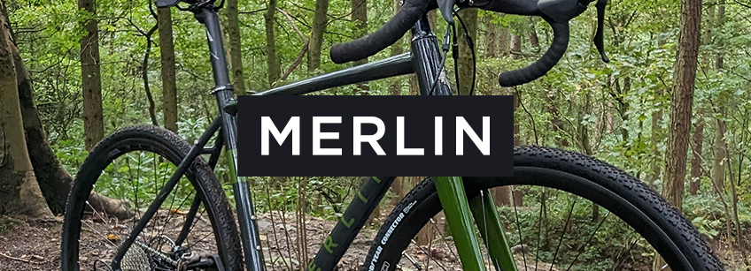

# 🚴‍♂️ Merlin Bike Sales Analysis

  

## 📊 Overview
This project involves an in-depth analysis of Merlin's bike sales data over a span of 4 years. The goal is to uncover actionable insights around product performance, customer segmentation, regional trends, and revenue distribution to help drive better decision-making across marketing, sales, and inventory.

## 🧱 Database Schema
Tables and Columns Used:

- Customers 💲: 
`customer_key`, `customer_id`, `customer_number`, `first_name`, `last_name`, `country`, `marital_status`, `gender`, `birthdate`, `create_date`
- Products 🚴‍♂️:
`product_key`, `product_id`, `product_number`, `product_name`, `category_id`, `category`, `subcategory`, `maintenance`, `cost`, `product_line`, `start_date`
- Sales 📈:
`order_number`, `product_key`, `customer_key`, `order_date`, `shipping_date`, `due_date`, `sales_amount`, `quantity`, `price`

## Entity R

