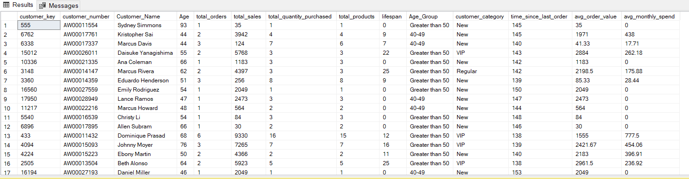

# 🚴‍♂️ Merlin Bike Sales Analysis
<p align="center">
  
</p>

## 📊 Business Problem
Merlin Bikes is a renowned manufacturer and retailer specializing in high-quality bicycles, accessories, and cycling apparel. With a diverse product range and a global customer base, the company aims to expand its market share and drive revenue growth by offering premium products that meet the needs of cycling enthusiasts.
Despite growing interest in biking products, Merlin Bikes faces challenges in optimizing sales strategies and product offerings across different categories and geographic markets. Insights reveal significant disparities in product performance, customer engagement, and regional sales, highlighting the need for targeted strategies to maximize revenue potential, improve market penetration, and optimize product pricing.

This project involves an in-depth analysis of Merlin's bike sales data over a span of 4 years. The goal is to uncover actionable insights around product performance, customer segmentation, regional trends, and revenue distribution to help drive better decision-making across marketing, sales, and inventory.

---
## 🧱 Database Schema
Tables and Columns Used:

- Customers 💲: 
`customer_key`, `customer_id`, `customer_number`, `first_name`, `last_name`, `country`, `marital_status`, `gender`, `birthdate`, `create_date`
- Products 🚴‍♂️:
`product_key`, `product_id`, `product_number`, `product_name`, `category_id`, `category`, `subcategory`, `maintenance`, `cost`, `product_line`, `start_date`
- Sales 📈:
`order_number`, `product_key`, `customer_key`, `order_date`, `shipping_date`, `due_date`, `sales_amount`, `quantity`, `price`

---
## Entity Relationship Diagram (ERD)


🔑 Primary Keys
- Customers
   - `customer_key`: Serves as the primary key. It uniquely identifies each customer
- Products
   - `product_key`: Serves as the primary key. It uniquely identifies each product
- Sales
   - `order_number`: Serves as the primary key. It uniquely identifies each sales transaction

🔗 Foreign Keys
- Sales
   - `customer_key`: Foreign key referencing customer_key in the Customers table. This links each sale to a specific customer
   - `product_key`: Foreign key referencing product_key in the Products table. This links each sale to a specific product

---
## 📊 Key Analysis Areas
- Customer Lifetime Value (CLTV): Identify customers who contribute the most to revenue
- Product Profitability: Compare product costs vs. sales to identify high-margin items
- Sales Trends: Analyze sales by date, product, region, and category
- Customer Segmentation: Group customers by demographics and purchasing behavior
- Order Fulfillment: Track shipping and due dates for delay analysis
- Market Expansion Opportunities: Discover underperforming countries or categories

---
## 📈 Insights and Recommendations

1. KPI Reporting
   
    

   ```sql
   SELECT 'Total Sales' AS measure_name, FORMAT(SUM(sales_amount), 'N0') AS value FROM sales
   UNION ALL
   SELECT 'Total Items Sold', FORMAT(SUM(quantity), 'N0') FROM sales
   UNION ALL
   SELECT 'Avg Selling Price', FORMAT(ROUND(AVG(price), 2), 'N2') FROM sales
   UNION ALL
   SELECT 'Total Orders', FORMAT(COUNT(DISTINCT order_number),'N0') FROM sales
   UNION ALL
   SELECT 'Total Products', FORMAT(COUNT(DISTINCT product_name), 'N0') FROM products
   UNION ALL
   SELECT 'Total Customers', FORMAT(COUNT(DISTINCT customer_id),'N0') FROM customers
   UNION ALL
   SELECT 'Customers with Orders', FORMAT(COUNT(DISTINCT customer_key),'N0') FROM sales;
   ```

  - 📊 Business Insights from KPIs
    
    - 💰 Total Sales: $29,356,250
      - This indicates strong revenue performance, reflecting the effectiveness of the sales team and marketing strategies.
      - It provides a solid financial base for reinvestment in operations, marketing, or customer retention programs.

    - 📦 Total Items Sold: 60,423
      - A high number of units sold suggests good product-market fit and customer demand.
      - Inventory and supply chain teams should ensure stock levels are sufficient to meet continued demand.

    - 💲 Average Selling Price: $486.04
      - The average price point is relatively premium, hinting at a value-driven or high-quality brand positioning.
      - Bundling, upselling, or loyalty discounts could be explored without harming profitability too much.

    - 🧾 Total Orders: 27,659
      - A healthy number of transactions, indicating consistent customer engagement.
      - Analyzing order frequency per customer can identify potential for subscription models or repeat purchase incentives.

    - 🛒 Total Products: 295
      - A fairly broad product catalog provides opportunities for cross-selling and bundling strategies.
      - Consider reviewing low-selling items for removal or optimization.

    - 👥 Total Customers: 18,484
      - A large customer base offers strong potential for segmentation, targeting, and personalized marketing.
      - Focus on improving customer lifetime value and churn reduction.

    - 📈 Customers with Orders: 18,484
      - This matches the total customers, meaning every customer has made at least one purchase — a 100% conversion rate
      - This is an exceptional indicator of marketing and product effectiveness; however, further analysis should check for repeat purchases and retention

2. Country wise customer distribution

   

   ```sql
   SELECT country, COUNT(customer_key) AS total_customer FROM customers
   GROUP BY country ORDER BY total_customer DESC;
   ```

   💡 Insights:
   - The United States has the largest customer base (7,482 customers), accounting for ~40% of total customers
   - Australia and the United Kingdom follow with 3,591 and 1,913 customers respectively
   - Countries like France, Germany, and Canada have roughly similar customer numbers, all around 1,500–1,800
   - There are 337 customers with unclassified or missing country data (n/a), which may need data cleaning

   📌 Business Strategy:
   - Focus marketing and logistics optimization primarily in the US, as it holds the majority share
   - Consider expanding customer engagement efforts in Australia and the UK—high potential for revenue growth
   - Clean and validate customer data to minimize n/a entries for better geographic segmentation

3. Revenue by product category

   

   ```sql
   SELECT category, FORMAT(SUM(sales_amount),'N0') AS total_revenue FROM products p
   LEFT JOIN sales s ON p.product_key = s.product_key
   GROUP BY category HAVING SUM(sales_amount) IS NOT NULL
   ORDER BY total_revenue DESC;
   ```

   💡 Insights:
   - Bikes dominate the revenue stream with $28.3M, making up ~96% of total revenue.
   - Accessories generate $700K, and Clothing brings in $340K, which are marginal compared to Bikes.

   📌 Business Strategy:
   - Bikes are the main revenue geneartors —continue investing in their marketing, innovation, and upselling
   - Accessories and Clothing are underperforming. Either reposition these items as essential add-ons for bikes or consider bundling them for cross-sell opportunities
   - Reevaluate pricing, visibility, or product relevance in Accessories and Clothing categories

4. Revenue per customer

   

   ```sql
   SELECT c.customer_key, CONCAT(first_name, ' ', last_name) AS full_name,
   SUM(sales_amount) AS total_revenue FROM customers c
   LEFT JOIN sales s ON c.customer_key = s.customer_key
   GROUP BY c.customer_key, first_name, last_name
   ORDER BY total_revenue DESC;
   ```

  💡 Insights:
   - The top 17 customers each contributed over $10K in revenue
   - Kaitlyn Henderson, Nichole Nara, and Margaret He are the top 3 high-value customers with revenue around $13.2K+
   - There’s a tight cluster in the $12K–$13.2K range, indicating consistent purchase patterns among the top-tier customers

  📌 Business Strategy:
   - Group customers into Gold, Silver and Bronze category based on revenue and offer facilities like early acceess, discounts, gifts etc to prevent customer churn
   - Consider personalized engagement strategies (email campaigns, early access) to increase customer lifetime value
     
5. Distribution of items sold by country

   

   ```sql
   SELECT c.country, FORMAT(SUM(quantity),'N0') AS total_quantity_sold FROM customers c
   LEFT JOIN sales s ON c.customer_key = s.customer_key
   GROUP BY c.country ORDER BY total_quantity_sold DESC;
   ```

   💡 Insights:
   - United States (20,481 units) and Australia (13,346 units) lead in terms of quantity sold, indicating high market penetration
   - Countries like Germany (5,626) and France (5,559) have similar performance, presenting potential for regional marketing expansion
   - The ‘n/a’ country (871 units) points to possible data quality issues—data cleansing is needed for more accurate geographical insights

   📌 Business Strategy:
   - With over 20K+ units sold, the U.S. is the strongest market. Increase in inventory allocation, ad spend, and local partnerships in the U.S. will maintain dominance
   - Strong sales in Australia (13K+) indicate growth potential. Launching regional promotions or seasonal discounts might convert Australia into a high-revenue market like the U.S
   - Countries like Germany, France, and the UK show moderate sales. Using targeted marketing campaigns (localized ads, shipping discounts) might drive sales up by 10–15%

6. Top 5 revenue products

   

  ```sql
  SELECT TOP 5 p.product_name, FORMAT(SUM(sales_amount),'N0') AS total_revenue FROM products p
  LEFT JOIN sales s ON p.product_key = s.product_key
  GROUP BY p.product_name ORDER BY total_revenue DESC;
  ```

 🔎 Insights:
  - High-end mountain and touring bikes dominate the revenue chart 
  - Bike accessories (like helmets and tires) also appear, suggesting cross-selling opportunities with premium bike sales

 📌 Business Strategy:
  - Top revenue comes from Mountain-400-W and Touring bikes. Prioritize these products in marketing, ensure high inventory, and consider new variants based on customer feedback
  - Cross-sell accessories: Helmets and tire tubes appear among high earner. Use bundling strategies (e.g., "Buy a bike, get 20% off a helmet") to boost AOV (average order value)

7. Bottom 5 revenue products

   

   ```sql
   SELECT TOP 5 p.product_name, SUM(sales_amount) AS total_revenue FROM products p
   LEFT JOIN sales s ON p.product_key = s.product_key
   GROUP BY p.product_name HAVING SUM(sales_amount) IS NOT NULL
   ORDER BY total_revenue;
   ```

   🔎 Insights:
   - Low-cost accessory products naturally generate less revenue
   - These items could be used for bundling, promotions, or loyalty programs to drive customer retention and increase cart value
   - Consider inventory optimization to reduce overstocking of such low-performing SKUs

   📌 Business Strategy:
   - Items like Racing Socks and Patch Kits bring low revenue. Bundling them with premium products will lead to more sale
   - Run clearance sales.
   - Offer as freebies in loyalty programs or minimum cart values
     
8. 📊 Monthly Sales Trend

   

  ```sql
  SELECT FORMAT(order_date, 'yyyy-MMM') AS order_date,
  SUM(sales_amount) AS total_sales,
  COUNT(DISTINCT customer_key) AS total_customers,
  SUM(quantity) AS total_quantity
  FROM sales
  WHERE MONTH(order_date) IS NOT NULL
  GROUP BY FORMAT(order_date, 'yyyy-MMM')
  ORDER BY FORMAT(order_date, 'yyyy-MMM');
 ```

  🔎 Insights: 
  - Steady Growth: From Dec 2010 ($43K) to Dec 2012 ($24K), sales have grown over 13x—showing a solid upward trend in business performance.
  - Customer Base Expansion: Customer count increased from just 14 in Dec 2010 to 354 by Dec 2012, indicating strong market acquisition.
  - Healthy Conversion: The total quantity ordered seems to scale linearly with customer count, suggesting that new customers are actively purchasing.
  - Key Spikes: Major jumps were seen in:
       - Aug 2011 ($614K): Likely a seasonal or promotional period
       - Dec 2011 ($669K): Year-end sales boost
       - Dec 2012 ($624K): Another strong December, signaling a recurring pattern in high year-end sales

  📌 Business Strategy:
 - Launch major seasonal campaigns or limited-time offers during the peak months.Introducing exclusive product launches in these peak months
 - April 2012 (₹400K) and March 2012 (₹374K) showed noticeable dips. Use of targeted discounts, email nudges, or flash sales in low-performing months can improve the situation
 - Implement referral programs to accelerate word-of-mouth and promote retargeting ads during high-traffic months to increase conversion

9. 📈 Cummulative Sales Trend

    

 ```sql
 WITH t1 AS (
 SELECT YEAR(order_date) AS year, MONTH(order_date) AS month,
 SUM(sales_amount) AS total_sales FROM sales
 WHERE MONTH(order_date) IS NOT NULL
 GROUP BY YEAR(order_date), MONTH(order_date)
 )
 SELECT *, SUM(total_sales) OVER (PARTITION BY year ORDER BY year, month ROWS BETWEEN UNBOUNDED PRECEDING AND CURRENT ROW) AS cumulative_sales
 FROM t1;
```

🔎 Insights: 
- Consistent Uptrend: From $43K in Dec 2010 to over $1.77M by Apr 2012, cumulative sales show a clear upward growth, suggesting strong product-market fit
- Acceleration Mid-2011: Sales began compounding significantly from Apr–Jul 2011, indicating possible successful marketing efforts or product upgrades
- Sustained Momentum in 2012: Despite a dip in March 2012, Apr 2012 sales rebounded—showing resilience in customer demand
- Cumulative sales rose from ₹43K in Dec 2010 to ₹1.77M in Apr 2012, reflecting a strong growth trajectory
- The pace of cumulative sales growth slightly flattens in early 2012

📌 Business Strategy: 
- Scale winning strategies (ads, products, offers) that fueled the growth between 2010-12 by implementing automated marketing pipelines to support sustained demand generation
- Introducing  new product lines or categories to re-spark growth early 2012 may improve the sale
- Test new customer acquisition channels (influencer marketing, partnerships)

10. 🧩 Product performance and YoY analysis

    

```sql
WITH t1 AS (
  SELECT YEAR(order_date) AS year, category,p.product_name,
  SUM(sales_amount) AS total_sales FROM products p
  JOIN sales s ON p.product_key = s.product_key
  WHERE YEAR(order_date) IS NOT NULL
  GROUP BY YEAR(order_date), category, p.product_name
)
SELECT *,
AVG(total_sales) OVER (PARTITION BY product_name) AS avg_sales,
total_sales - AVG(total_sales) OVER (PARTITION BY product_name) AS avg_diff,
CASE 
  WHEN total_sales > AVG(total_sales) OVER (PARTITION BY product_name) THEN 'Above_Average'
  WHEN total_sales < AVG(total_sales) OVER (PARTITION BY product_name) THEN 'Below_Average'
  ELSE 'Average'
END AS avg_change,
LAG(total_sales, 1) OVER (PARTITION BY product_name ORDER BY product_name) AS prev_year_sales,
total_sales - LAG(total_sales, 1) OVER (PARTITION BY product_name ORDER BY product_name) AS change_wrt_prev_year,
CASE 
  WHEN total_sales > LAG(total_sales, 1) OVER (PARTITION BY product_name ORDER BY product_name) THEN 'Increasing'
  WHEN total_sales < LAG(total_sales, 1) OVER (PARTITION BY product_name ORDER BY product_name) THEN 'Decreasing'
  ELSE 'No Change'
END AS change
FROM t1;
```

🔎 Insights: 
- Bikes: Show both high-volume and high-variance sales
   - Mountain-100 and Mountain-200 variants consistently deliver large sales
   - Strong positive YoY growth in key models like Mountain-200 Black, 42 (+₹602K)
- Accessories: Mixed performance
   - All-Purpose Bike Stand and Fender Set – Mountain show strong upward trends
   - Mountain Tire Tube and Bike Wash – Dissolver show YoY decline in later years
- Clothing: Struggles persist
   - Most clothing items (e.g., Classic Vest-L, S, M) are marked “Below_Average” with negative YoY change

📈 Product-Level Performance
- Top Performers:
  - Mountain-200 Black, 42: $945,540 in sales (+$602,619 YoY) → best overall performer
  - Mountain-100 Black, 42: $202,500 — steady high performer
  - Fender Set – Mountain: grew from 110 to 44,484 — excellent YoY surge
- Underperformers:
  - Classic Vest-L, M, S: Showing multi-year decline and “Below_Average” performance
  - Bike Wash – Dissolver and Mountain Tire Tube showed negative YoY growth
  - Mountain-100 Silver, 38–44: No change or decline — stagnant products

📌 Business Strategy: 
- Increase production and regional availability of models like Mountain-200 Black, 42 and Mountain-100 Black, 42 show excellent traction
  - Consider launching new variants or premium versions of these bikes
- Most clothing SKUs are underperforming (declining YoY, marked as “Below_Average”)
- Conduct customer surveys to identify why clothing isn't converting (fit, style, pricing?)
  - Bundle underperforming clothing with top accessories or bikes to move stock
  - Consider seasonal or limited collections to reignite interest
- Strong performers: Fender Set – Mountain, All-Purpose Bike Stand
- Weak performers: Mountain Tire Tube (decline in 2014), Bike Wash – Dissolver
  - Prioritize marketing and bundling high-performing accessories
  - Evaluate utility and quality of low-performers; consider discontinuation or redesign

11. Part-to-Whole Sales by Category

    

```sql
WITH t1 AS (
  SELECT COALESCE(category, 'N/A') AS category,
  COALESCE(SUM(sales_amount), 0) AS total_sales FROM products p
  LEFT JOIN sales s ON p.product_key = s.product_key
  GROUP BY p.category
)
SELECT *,
SUM(total_sales) OVER () AS grand_sale,
(total_sales * 100.0) / SUM(total_sales) OVER () AS per_share
FROM t1;
```

🔎 Insights: 
- Bikes are the primary revenue driver by a massive margin
- Accessories and Clothing show very limited traction, but may have cross-selling potential

📌 Business Strategy: 
- Clothing and accessories contribute only ~3.5% combined. Bundling them with bike sales (e.g., free gloves with a mountain bike) can be a good move
- Launch category-specific promotions to boost visibility
- Review product quality, style, or pricing — consider revamp based on customer feedback

12. Price and Product Segmentation

    
    

-- Price Segmentation
```sql
WITH product_segments AS (
  SELECT product_key, product_name, cost,
  CASE 
    WHEN cost < 100 THEN 'Below 100'
    WHEN cost BETWEEN 100 AND 500 THEN '100-500'
    WHEN cost BETWEEN 500 AND 1000 THEN '500-1000'
    ELSE 'Above 1000'
  END AS cost_range
  FROM products
)
SELECT cost_range, COUNT(DISTINCT product_key) AS total_products
FROM product_segments
GROUP BY cost_range
ORDER BY total_products DESC;
```
-- Customer Segmentation

```sql
WITH customer_spending AS (
  SELECT c.customer_key,
  SUM(sales_amount) AS total_spend,
  DATEDIFF(MONTH, MIN(order_date), MAX(order_date)) AS lifespan
  FROM customers c
  LEFT JOIN sales s ON c.customer_key = s.customer_key
  GROUP BY c.customer_key
)
SELECT customer_category, COUNT(DISTINCT customer_key) AS total_customer FROM (
  SELECT *,
  CASE 
    WHEN lifespan >= 12 AND total_spend > 5000 THEN 'VIP'
    WHEN lifespan >= 12 AND total_spend <= 5000 THEN 'Regular'
    ELSE 'New'
  END AS customer_category
  FROM customer_spending
) t1
GROUP BY customer_category;
```

🔎 Insights: 
- New Customers dominate (84.5%), but likely with low loyalty or single-purchase behavior. VIPs & Regulars are much fewer (~16%), yet potentially represent repeat, high-value buyers
- 66% of products are priced under $500, indicating a focus on budget offerings. Only ~16% of inventory is premium-priced (>$1000) – a potential gap for high-margin growth

📌 Business Strategy: 
- High-value VIP and regular customers are few but likely represent disproportionate revenue
   - Launch exclusive VIP programs, early access sales, or loyalty rewards
   - Create tailored bundles or add-ons (e.g., bike + accessories) to boost AOV (Average Order Value)
   - Use targeted marketing emails to upsell mid- to high-priced products
- New customers make up ~85% of users – likely casual or one-time buyers
   - Offer first-purchase discounts or welcome bundles
   - Guide them toward popular products via “Top Seller for Beginners” tags
   - Use remarketing strategies (email, social media) to encourage repeat buys
- Only 39 premium products (>$1000) exist — low for potentially high-LTV segments like VIPs
   - Expand the premium product portfolio (e.g., performance bikes, exclusive gear)
   - Bundle high-cost items with services (warranty, upgrades) to justify pricing
   - Cross-promote with accessories or seasonal packages

13. 👤 Customer Report Analysis

    

```sql
WITH Root_Query AS (
    /*---------------------------------------------------------------------------
    1) Base Query: Retrieving core columns from tables
    ---------------------------------------------------------------------------*/
    SELECT 
        c.customer_key,
        customer_number,
        CONCAT(first_name, ' ', last_name) AS Customer_Name,
        birthdate,
        DATEDIFF(YEAR, birthdate, GETDATE()) AS Age,
        order_number,
        product_key,
        order_date,
        sales_amount,
        quantity
    FROM customers c
    LEFT JOIN sales s ON c.customer_key = s.customer_key
    WHERE order_date IS NOT NULL
),

Customer_Aggregation AS (
    /*---------------------------------------------------------------------------
    2) Customer Aggregations: Summarizing key metrics at the customer level
    ---------------------------------------------------------------------------*/
    SELECT 
        customer_key,
        customer_number,
        Customer_Name,
        Age,
        COUNT(DISTINCT order_number) AS total_orders,
        SUM(sales_amount) AS total_sales,
        SUM(quantity) AS total_quantity_purchased,
        COUNT(DISTINCT product_key) AS total_products,
        MAX(order_date) AS last_order_date,
        DATEDIFF(MONTH, MIN(order_date), MAX(order_date)) AS lifespan
    FROM Root_Query
    GROUP BY customer_key, customer_number, Customer_Name, Age
)

SELECT 
    customer_key,
    customer_number,
    Customer_Name,
    Age,
    total_orders,
    total_sales,
    total_quantity_purchased,
    total_products,
    lifespan,
    CASE 
        WHEN Age < 20 THEN 'Under 20'
        WHEN Age BETWEEN 20 AND 29 THEN '20-29'
        WHEN Age BETWEEN 30 AND 39 THEN '30-39'
        WHEN Age BETWEEN 40 AND 49 THEN '40-49'
        ELSE 'Greater than 50'
    END AS Age_Group,
    CASE 
        WHEN lifespan >= 12 AND total_sales > 5000 THEN 'VIP'
        WHEN lifespan >= 12 AND total_sales <= 5000 THEN 'Regular'
        ELSE 'New'
    END AS customer_category,
    DATEDIFF(MONTH, last_order_date, GETDATE()) AS time_since_last_order,
    CASE 
        WHEN total_orders = 0 THEN 0
        ELSE ROUND(total_sales / total_orders,2)
    END AS avg_order_value,
    CASE 
        WHEN lifespan = 0 THEN 0
        ELSE ROUND(total_sales / lifespan,2)
    END AS avg_monthly_spend
FROM Customer_Aggregation;
```

🔎 Insights: 
- New Customers Make Up Majority — But Have Low Engagement. Many "New" customers have:
  - Low total sales and zero avg. monthly spend
  - Lifespan often ≤1 month, suggesting no repeat orders
  - Long time since last order (140–150+ days)
👉 Most new users are not converting into repeat buyers

- VIP Customers Are Highly Profitable.VIPs like Dominique Prasad and Johnny Moyer:
  - High avg order values ($1555 – $2961)
  - High monthly spend ($236 – $777)
  - Long customer lifespans (11–16 months)
👉 Interpretation: VIPs are your revenue backbone — small in number, but high in value.

- Several High-Spend Customers Have Been Inactive
- Despite high order values, many have not purchased in over 140 days
  - Example: Ebony Martin (avg order: $2183, last order 140 days ago), Marcus Davis (₹41.33, 144 days ago)
👉 Interpretation: Leakage in revenue due to poor re-engagement

-  Some Customers Have High Order Values But Only Bought Once
  - Daniel Miller, Emily Rodriguez, Lance Ramos — all with high avg order values but only 1 purchase
👉 Interpretation: Missed opportunities to build customer loyalty and increase LTV

📌 Business Strategy: 
- Launch "Personalized Discount" email campaigns with personalized product suggestions or discount codes
- Use SMS/push reminders for customers inactive >90 days but with high avg order values
- Incentivize 2nd purchase with “Buy Again & Save” coupons
- Offer Premium customers with exclusive early access to products, limited drops, or loyalty tiers
- Set up email onboarding flows with product education, usage tips, and customer stories

14. Products Analysis Report

    

```sql
WITH Product_Base_Query AS (
    /*---------------------------------------------------------------------------
    1) Base Query: Retrieving core columns from fact_sales and dim_products
    ---------------------------------------------------------------------------*/
    SELECT 
        p.product_key,
        product_name,
        category,
        subcategory,
        cost,
        order_number,
        order_date,
        customer_key,
        sales_amount,
        quantity
    FROM products p
    LEFT JOIN sales s ON p.product_key = s.product_key
    WHERE order_date IS NOT NULL
),

Product_Aggregation AS (
    /*---------------------------------------------------------------------------
    2) Product Aggregations: Summarizing key metrics at the product level
    ---------------------------------------------------------------------------*/
    SELECT 
        product_key,
        product_name,
        category,
        subcategory,
        cost,
        COUNT(DISTINCT order_number) AS total_orders,
        MAX(order_date) AS last_sale_date,
        SUM(sales_amount) AS total_sales,
        SUM(quantity) AS total_quantity,
        COUNT(DISTINCT customer_key) AS total_customers,
        DATEDIFF(MONTH, MIN(order_date), MAX(order_date)) AS lifespan,
        ROUND(AVG(CAST(sales_amount AS FLOAT) / NULLIF(quantity, 0)), 1) AS avg_selling_price
    FROM Product_Base_Query
    GROUP BY product_key, product_name, category, subcategory, cost
)

SELECT 
    product_key,
    product_name,
    category,
    subcategory,
    cost,
    last_sale_date,
    DATEDIFF(MONTH, last_sale_date, GETDATE()) AS recency_in_months,
    CASE
        WHEN total_sales > 50000 THEN 'High-Performer'
        WHEN total_sales >= 10000 THEN 'Mid-Range'
        ELSE 'Low-Performer'
    END AS product_segment,
    lifespan,
    total_orders,
    total_sales,
    total_quantity,
    total_customers,
    avg_selling_price,
    CASE 
        WHEN total_orders = 0 THEN 0
        ELSE ROUND(total_sales / total_orders,2)
    END AS avg_order_revenue,
    CASE
        WHEN lifespan = 0 THEN total_sales
        ELSE ROUND(total_sales / lifespan,2)
    END AS avg_monthly_revenue
FROM Product_Aggregation;
```

🔎 Insights: 
- 🔝 Touring-1000 Yellow-46 made $4.1M in total sales with $37.3K/month on average
- Road-250 Red-44 and Road-350-W Yellow-48 each contribute $700K+, with steady sales
- 💼 High-performing products have long lifespans (20–24 months), showing sustained demand and customer trust
- 💰 Premium bikes sell less frequently but at high average order values, like Mountain-100 Silver-38 has an average selling price of $3,400 with niche appeal
- 🔁 Mid-range accessories and clothing perform steadily:
   - Items like Hitch Rack - 4-Bike and Short-Sleeve Jerseys bring in $1.8K–$3.3K/month consistently
- ⚠️ Some products are outdated or inactive like, Sport-100 Helmet, Touring-3000 Blue-54 have not sold in over 137 months, despite existing order history

📌 Business Strategy: 
- Increase marketing and inventory for Touring-1000 Yellow-46, Road-250 Red-44, Road-350-W Yellow-48.
   - Feature them in homepage banners and seasonal campaigns
   - Offer 0% EMI or financing to encourage high-ticket purchases
- Combine Hitch Rack, Helmets, and Jerseys with top bike models by creating starter kits for new buyers to raise average order value
- Retire or discount products with zero sales in 130+ months
- Reinvest shelf space in new or trending models

## 🛠️ SQL Techniques Used

- **Window Functions**: `LAG()`, `DENSE_RANK()`, `AVG()`, etc.
- **Joins**: `INNER`, `LEFT JOIN` across 5+ tables
- **Aggregates**: `SUM()`, `COUNT()`, `DATEDIFF()`
- **Case Logic**: `CASE WHEN` used for dynamic labels and segmentation
- **Time Functions**: `DATEPART`, `DATENAME`, `MONTH()`, `CAST()`

---

## 🔑 Key Takeaways & Strategic Actions

### 📦 Products:
- High-Value Products Drive Revenue: A few premium bikes (e.g., Touring-1000 Yellow-46, Road-250 Red-44) contribute over $4M and $700K in revenue respectively
- Mid-Range Products Have Consistent Demand: Accessories like Hitch Rack and Jerseys show stable monthly sales of $1.8K–$3.3K
- Premium Products Have Niche but Profitable Appeal: Products like Mountain-100 Silver-38 show low volume but high unit price (avg. $3,400 per sale)
- Aging Inventory Detected: Several products (e.g., Sport-100 Helmet, Touring-3000 Blue) haven’t sold in 130+ months, signaling outdated stock or irrelevant listings

### 🧑‍🤝‍🧑 Customers
- Customer Base is New-Centric: Over 80% of customers are tagged as "New", but most haven’t reordered (high time_since_last_order values)
- VIP and Regular Customers Are Underrepresented: VIPs (1,655) and Regulars (2,198) form a small portion of the base compared to New customers (14,631)
- High Spenders Are Often Older (Age > 50): Many high average monthly spenders are in the “Greater than 50” age group
- Order Frequency is Low Across Most Segments: Even high-value customers show low total_orders and lifespan, implying weak retention

---

## 🧾 Conclusion

The Merlin Sales Analysis gives a clear and comprehensive picture of a brand with strong potential—but uneven execution. Merlin’s success is driven by a few high-performing bikes, like the *Touring-1000 Yellow-46* and *Road-250 Red-44*, which generate the maximum share of revenue and demonstrate  customer demand. Yet, surrounding these top performers is a long list of underutilized products—some stagnant for over a decade—suggesting an urgent need for catalog optimization. On the customer front, while Merlin has done well in attracting new buyers, the retention gap is significant. Most customers make a single purchase and never return, even though a smaller segment of VIP and older customers show strong loyalty, higher spend, and longer engagement lifespans. This pattern signals a crucial opportunity: by deepening relationships with high-value customers and re-engaging new ones with timely, personalized outreach tecgniques, Merlin can dramatically improve customer lifetime value. Meanwhile, bundling high-performing bikes with accessories, phasing out inactive SKUs, and strategically pricing mid-range products will ensure a more profitable product portfolio. Ultimately, this analysis isn’t just about numbers—it’s a call to build a more customer-centric, data-informed, and agile business strategy. 


