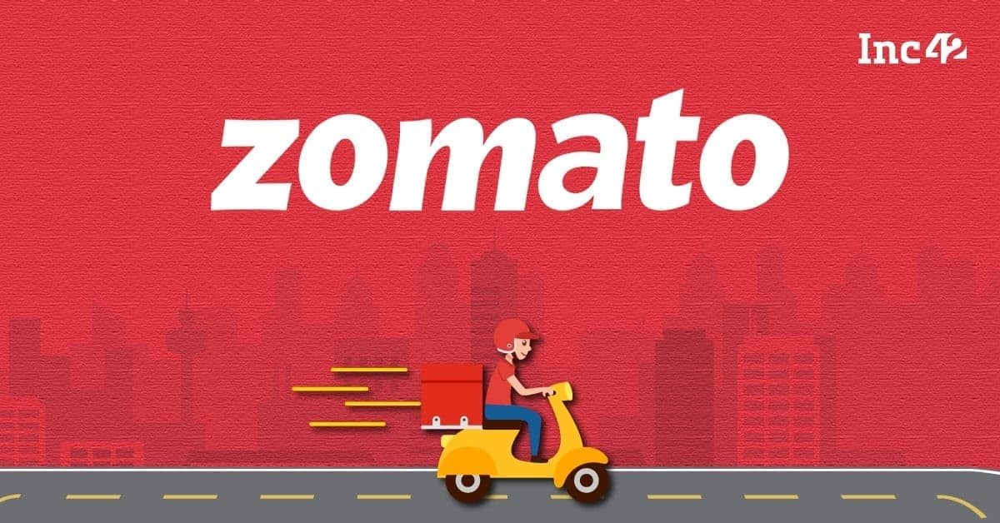
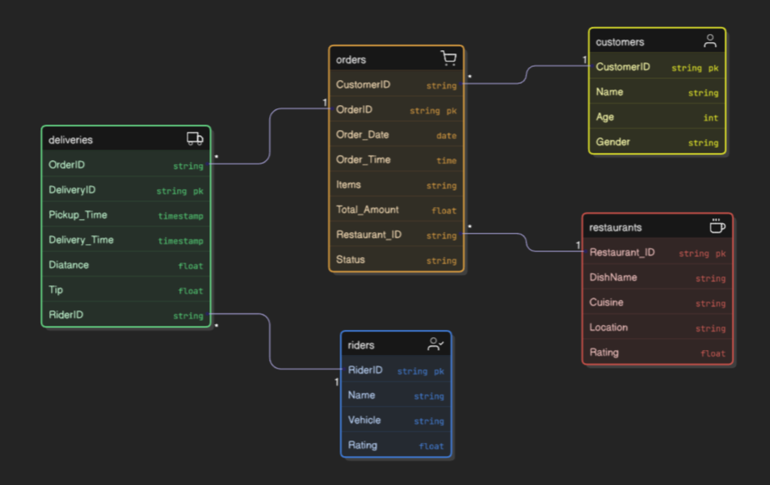

# 🍽️ Zomato Sales Analysis SQL Project

## 📌 Overview
This SQL project explores the sales, delivery, and customer behavior data of  Zomato. It includes 20 advanced SQL queries to uncover performance drivers, customer segmentation, item trends, and operational insights.

---

## 🧩 Database Schema

- **Customer**: `CustomerID`, `Name`,`Email`,`Address`, `Age`, `Gender`  
- **Orders**: `OrderID`, `CustomerID`, `Restaurant_ID`, `Order_Date`, `Order_Time`, `Items`, `Total_Amount`, `Status`  
- **Deliveries**: `DeliveryID`, `OrderID`, `RiderID`, `Pickup_Time`, `Delivery_Time`, `Distance_covered`, `Tip`  
- **Restaurants**: `Restaurant_ID`, `DishName`, `Cuisine`, `Location`, `Rating`,`Contact`  
- **Riders**: `RiderID`, `Name`, `Vehicle`, `Rating`,`Phone`

---

## Entity Relationship Diagram (ERD)
The ERD for the analysis is present as follows

🔑 Primary Keys
Customers: CustomerID

Orders: `OrderID`

Restaurants: `Restaurant_ID`

Deliveries: `DeliveryID`

Riders: `RiderID`

🔗 Foreign Keys
Orders.`CustomerID` → Customers.`CustomerID`

Orders.`Restaurant_ID` → Restaurants.`Restaurant_ID`

Deliveries.`OrderID` → Orders.`OrderID`

Deliveries.`RiderID`→ Riders.`RiderID`

## 📊 Analytical Insights & Recommendations

### 1. 🔝 Top 5 Dishes Ordered by a specific customer(eg. David Smith)

- 👉 Great for personalizing recommendations and retention.

### 2. ⏰ Peak Order Timing
- Most orders placed between **6PM - 8PM**.
- 📌 Allocate delivery staff and run promotions during this slot.

### 3. 💸 Average Order Value of Power Users
- High-frequency users (>400 orders) spend ₹430–₹550 per order.
- 🎯 Reward loyalty via exclusive discounts or early access.

### 4. 🎖️ High-Value Customers
- Users with lifetime spend > ₹22,000.
- 📦 Eligible for VIP tiers and cashback campaigns.

### 5. ⚠️ Undelivered Orders by Restaurant
- Found restaurants with 50+ undelivered orders.
- 🔧 Need process audit or customer service intervention.

### 6. 🏆 Top 10 Revenue Restaurants
- Ranked using `DENSE_RANK()` on total revenue.
- 📣 Feature these partners more prominently in app feeds.

### 7. 🍟 Most Popular Items per Restaurant
- Single most ordered dish per restaurant.
- 🍽️ Helps with bundle creation and ad copywriting.

### 8. 📈 Customer Order Trend (Monthly)
- Monthly activity tracking.
- 📅 Run re-engagement or reactivation campaigns based on lulls.

### 9. 🔁 Restaurant Cancellations MoM
- Trend shows increase/decrease in non-delivered orders.
- 📊 Pinpoint operational issues.

### 10. 🚴‍♂️ Average Rider Delivery Time
- Riders' average time ranged from **~25–45 mins**.
- 🏅 Reward fast riders or provide training for slower ones.

### 11. 📉 MoM Order Growth (Restaurant-Level)
- Calculated delivery growth rates with `LAG()`.
- 📈 Used to recommend promotion boosts for underperformers.

### 12. 🧱 Customer Segmentation: Gold vs. Silver
- **Gold**: Above avg. spend  
- **Silver**: Below avg. spend  
- 🪙 Golds → retention offers, Silvers → upselling offers.

### 13. 💵 Rider Earnings
- Formula: `8% of Order Value + Tip`.
- 🧮 Helps HR/Finance departments track income distribution.

### 14. ⭐ Rider Rating Simulation
- Based on delivery duration:
  - `<30min`: 5⭐, `30–40`: 4⭐, `>60`: 1⭐, etc.
- 🧭 Performance benchmark metric.

### 15. 🗓️ Restaurant Busiest Day
- Found most popular day of the week per restaurant.
- 👷 Helps schedule staffing accordingly.

### 16. 💰 Customer Lifetime Value
- Aggregated total revenue per customer.
- 🎯 Ideal for CLV-based marketing targeting.

### 17. 📅 Sales Trends Over Months
- Month-over-month revenue trend and percentage change.
- 📊 Use for financial forecasting and budget allocation.

### 18. 🏎️ Fastest vs. Slowest Riders
- Based on avg. delivery time.
- 📌 Can be tied to incentives or mentorship.

### 19. 🌦️ Seasonal Item Popularity
- Mapped dish orders across Spring, Summer, Rainy, Winter.
- 🌸 Helps in launching seasonal combos.

### 20. 📈 Restaurant Growth Ratio (MoM)
- Tracked order count growth ratio using `LAG()`.
- 🧩 Used to detect momentum and trigger intervention.

---

## 🛠️ SQL Techniques Used

- **Window Functions**: `LAG()`, `DENSE_RANK()`, `AVG()`, etc.
- **Joins**: `INNER`, `LEFT JOIN` across 5+ tables
- **Aggregates**: `SUM()`, `COUNT()`, `DATEDIFF()`
- **Case Logic**: `CASE WHEN` used for dynamic labels and segmentation
- **Time Functions**: `DATEPART`, `DATENAME`, `MONTH()`, `CAST()`

---

## 🧪 Sample Use Cases

- Build customer loyalty engine based on lifetime value and segmentation.
- Create operational dashboard for rider performance and restaurant delivery failures.
- Recommend promotions by season, time slot, or trending dishes.
- Highlight high-performing restaurants and customers for sales/marketing.

---

## 📁 Folder Structure

