# 🍽️ Zomato Sales Analysis SQL Project


## 📈 Business Problem
Zomato is a leading global food delivery and restaurant discovery platform that connects millions of customers with a wide range of restaurants across various locations. With a focus on providing seamless food delivery services, Zomato aims to enhance customer experiences and improve restaurant business outcomes.

Zomato faces challenges in optimizing its sales, customer engagement, and operational efficiency. Despite having a large user base, inconsistencies in customer behavior, order frequency, and delivery performance across regions indicate the need for targeted strategies to maximize revenue, improve market penetration, and enhance overall operational effectiveness.

The challenges faced by Zomato are addressed through a series of advanced SQL queries. These queries provide insights into key areas such as customer segmentation, order trends, restaurant performance, and delivery efficiency. By analyzing customer behavior, product popularity, and monthly sales patterns, the SQL queries help identify high-value customers, peak order times, and underperforming restaurants. Additionally, the use of aggregation, ranking, and window functions enables Zomato to optimize operations, reduce delivery time variability, and improve customer retention through targeted strategies.


## 🧩 Database Schema

- **Customer**: `CustomerID`, `Name`,`Email`,`Address`, `Age`, `Gender`  
- **Orders**: `OrderID`, `CustomerID`, `Restaurant_ID`, `Order_Date`, `Order_Time`, `Items`, `Total_Amount`, `Status`  
- **Deliveries**: `DeliveryID`, `OrderID`, `RiderID`, `Pickup_Time`, `Delivery_Time`, `Distance_covered`, `Tip`  
- **Restaurants**: `Restaurant_ID`, `DishName`, `Cuisine`, `Location`, `Rating`,`Contact`  
- **Riders**: `RiderID`, `Name`, `Vehicle`, `Rating`,`Phone`

## Entity Relationship Diagram (ERD)
The ERD for the analysis is present as follows


🔑 Primary Keys
- Customers: CustomerID

- Orders: `OrderID`

- Restaurants: `Restaurant_ID`

- Deliveries: `DeliveryID`

- Riders: `RiderID`

🔗 Foreign Keys

- Orders.`CustomerID` → Customers.`CustomerID`

- Orders.`Restaurant_ID` → Restaurants.`Restaurant_ID`

- Deliveries.`OrderID` → Orders.`OrderID`

- Deliveries.`RiderID`→ Riders.`RiderID`

## 📊 Analytical Insights & Recommendations

### 1. 🔝 Top 5 Dishes Ordered by a specific customer(eg. David Smith)

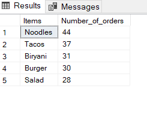

```sql
WITH top_5_food AS (
  SELECT o.Items, COUNT(o.Items) AS Number_of_orders,
         DENSE_RANK() OVER (ORDER BY COUNT(o.Items) DESC) AS rank
  FROM Customer c
  JOIN Orders o ON c.Customer_ID = o.Customer_ID
  WHERE c.Name = 'David Smith' AND o.Order_Date BETWEEN '2023-06-01' AND '2023-12-31'
  GROUP BY o.Items
)
SELECT Items, Number_of_orders FROM top_5_food WHERE rank <= 5;
```

👉 Based on customer segmentation and this result personalised recommendations can be generated along with other offers to increase CLV. For example here Since Salad is the lowest order item, it can be recommended along with noodles targeting a healthy package of meal.

### 2. ⏰ Peak Order Timing
- Most orders placed between **10AM - 12PM**.

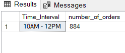

```sql
WITH popular_timeslot AS (
  SELECT Order_ID, Order_Time,
         CASE 
           WHEN DATEPART(hour, Order_Time) BETWEEN 0 AND 1 THEN '12AM - 2AM'
           WHEN DATEPART(hour, Order_Time) BETWEEN 2 AND 3 THEN '2AM - 4AM'
           WHEN DATEPART(hour, Order_Time) BETWEEN 4 AND 5 THEN '4AM - 6AM'
           WHEN DATEPART(hour, Order_Time) BETWEEN 6 AND 7 THEN '6AM - 8AM'
           WHEN DATEPART(hour, Order_Time) BETWEEN 8 AND 9 THEN '8AM - 10AM'
           WHEN DATEPART(hour, Order_Time) BETWEEN 10 AND 11 THEN '10AM - 12PM'
           WHEN DATEPART(hour, Order_Time) BETWEEN 12 AND 13 THEN '12PM - 2PM'
           WHEN DATEPART(hour, Order_Time) BETWEEN 14 AND 15 THEN '2PM - 4PM'
           WHEN DATEPART(hour, Order_Time) BETWEEN 16 AND 17 THEN '4PM - 6PM'
           WHEN DATEPART(hour, Order_Time) BETWEEN 18 AND 19 THEN '6PM - 8PM'
           WHEN DATEPART(hour, Order_Time) BETWEEN 20 AND 21 THEN '8PM - 10PM'
           WHEN DATEPART(hour, Order_Time) BETWEEN 22 AND 23 THEN '10PM - 12AM'
         END AS Time_Interval
  FROM Orders
)
SELECT TOP 1 Time_Interval, COUNT(Order_ID) AS number_of_orders 
FROM popular_timeslot 
GROUP BY Time_Interval 
ORDER BY number_of_orders DESC;
```

🔍 Interpretation:
This is a key pre-lunch window, indicating that customers are most active during late morning hours — likely placing orders for lunch either at work or from home.

💡 Strategic Recommendations:
- Optimize Delivery Staff: Increase rider availability and reduce prep time during this slot to handle peak demand
- Boost Marketing: Run time-sensitive discounts or "early lunch" combo offers between 10–12PM
- Menu Adjustments: Promote fast-moving and easy-to-prepare items during this window for quicker turnarounds
- Push Notifications: Use app or SMS nudges at 9:45–10:00AM to remind users about meal deals before the rush begins

### 3. 💸 Average Order Value of Power Users (i.e. users who have ordered more than 400 times)

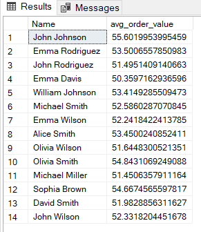

```sql
SELECT Name, SUM(Total_Amount) / COUNT(Order_ID) AS avg_order_value 
FROM Customer c 
LEFT JOIN Orders o ON c.Customer_ID = o.Customer_ID 
GROUP BY Name 
HAVING COUNT(Order_ID) > 400 
ORDER BY COUNT(Order_ID) DESC;
```

💡 Insight: High-Value Order Patterns Among Power Users
- The highest average order value is from John Johnson at $55.60, followed by Emma Rodriguez ($53.50) and William Johnson ($53.41)
- A cluster of customers — 10 out of 14 listed — consistently maintain an average order value above $51, suggesting a strong mid-to-premium tier customer segment
- Emma Wilson is the outlier with the lowest average value at ₹22.24, indicating either frequent low-cost orders or test/failed transactions.

📌 Recommendations:

- Offer tiered loyalty programs to customers with an average spend above $53 — they're most likely to engage in premium offerings.
- Target customers with an average order value between $50–$52 (e.g., David Smith, John Rodriguez) with combo offers or free delivery over $55 to nudge them higher.
- Review Emma Wilson's order pattern — low value may indicate dissatisfaction, high frequency of small items, or potential test activity.
- Group customers by AOV segments and personalize app/homepage recommendations accordingly.

### 4. 🎖️ High-Value Customers

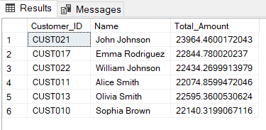

```sql
SELECT c.Customer_ID, Name, SUM(Total_Amount) AS Total_Amount 
FROM Customer c 
LEFT JOIN Orders o ON c.Customer_ID = o.Customer_ID 
GROUP BY c.Customer_ID, Name 
HAVING SUM(Total_Amount) > 22000 
ORDER BY COUNT(Order_ID) DESC;
```

💡 Insight:
- John Johnson tops the chart with a total spend of $23,964.46
- Others in the top segment: Emma Rodriguez ($22,844.78), William Johnson ($22,434.27), and Alice Smith ($22,074.86)
- These customers represent a premium segment and are ideal for loyalty programs, personalized offers, and early access to new dishes

📌 Recommendation: Offer exclusive discounts, referral bonuses, or a "Gold" tier membership to retain and engage these high-value customers

### 5. ⚠️ Undelivered Orders by Restaurant

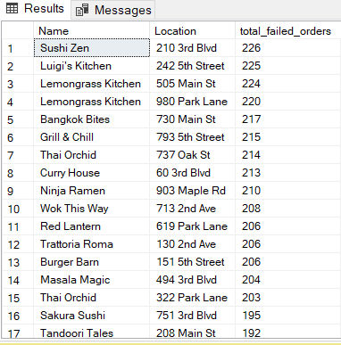

```sql
SELECT Name, Location, COUNT(DISTINCT Order_ID) AS total_failed_orders 
FROM Restaurants r 
LEFT JOIN Orders o ON r.Restaurant_ID = o.Restaurant_ID 
WHERE Status = 'Not delivered' 
GROUP BY Name, Location 
ORDER BY total_failed_orders DESC;
```
💡 Insight:
- Sushi Zen (226), Luigi’s Kitchen (225), and Lemongrass Kitchen (224) have the highest delivery failure counts
- A total of 10+ restaurants crossed the 200+ failed orders threshold

⚠️ Critical Insight: Sushi Zen appears both as a top revenue generator and a top in failed deliveries — a red flag

🛠️ Recommendation:
- Audit operational flow at Sushi Zen and Luigi’s Kitchen — focus on packaging, rider delays, or system glitches
- Track repeat failures per customer; it risks customer churn
  
### 6. 🏆 Top 10 Revenue Restaurants

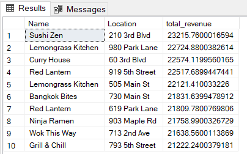

```sql
WITH top_restaurants AS (
  SELECT Name, Location, SUM(Total_Amount) AS total_revenue, 
         DENSE_RANK() OVER (ORDER BY SUM(Total_Amount) DESC) AS rank 
  FROM Restaurants r 
  LEFT JOIN Orders o ON r.Restaurant_ID = o.Restaurant_ID 
  GROUP BY Name, Location
)
SELECT Name, Location, total_revenue FROM top_restaurants WHERE rank <= 10;
```

💡 Insight:
- Sushi Zen tops the list with $23,215 total revenue
- Close competitors include Lemongrass Kitchen ($22,724) and Curry House ($22,574)

⚠️ Observation: Sushi Zen appears in both top revenue and top failed orders – a red flag suggesting operational issues despite popularity

📌 Recommendation:
- These restaurants should be featured in search rankings and promotional banners
- However, Sushi Zen must resolve operational gaps to prevent customer churn

### 7. 🍟 Most Popular Items per Restaurant

Single most ordered dish per restaurant.
  
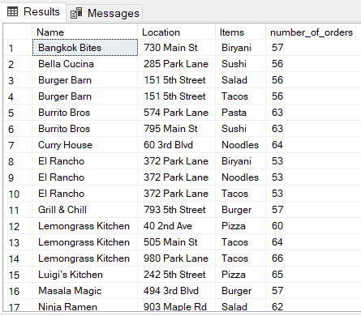

```sql
WITH most_popular_items AS (
  SELECT Name, Location, Items, COUNT(Items) AS number_of_orders,
         DENSE_RANK() OVER (PARTITION BY Name, Location ORDER BY COUNT(Items) DESC) AS rank
  FROM Restaurants r 
  LEFT JOIN Orders o ON r.Restaurant_ID = o.Restaurant_ID 
  GROUP BY Name, Location, Items
)
SELECT Name, Location, Items,number_of_orders FROM most_popular_items WHERE rank = 1;;
```
💡 Insight:
- Pizza and Tacos are high-frequency items across several restaurants (up to 66 orders).
- Noodles and Salad are also recurrent popular items.

📌 Recommendation:
- Design combo offers or item-based campaigns featuring these dishes
- Optimize inventory and preparation times for these SKUs
- Run localized ads featuring these popular dishes to increase order frequency from those restaurants
- Highlight these items on Zomato's app and website with badges like "Most Popular" and run targeted promotions or discounts on these items to increase conversion

### 8. 📈 Customer Order Trend (Monthly)

- Monthly activity tracking.
  
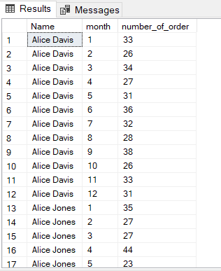

```sql
SELECT Name, MONTH(Order_Date) AS month, COUNT(DATEPART(month, Order_Date)) AS number_of_order 
FROM Customer c 
LEFT JOIN Orders o ON c.Customer_ID = o.Customer_ID 
GROUP BY Name, MONTH(Order_Date) 
ORDER BY Name, month;
```

💡 Insight:
- Alice Davis shows a stable and increasing trend, peaking at 38–39 orders/month in Sept–Oct
- Alice Jones also shows high variation, with 44 orders in May, up from 27 in Jan

📌 Recommendation: These customers are engaged consistently year-round, and marketing campaigns can be timed appropriately to coincide with months of high 
  
### 9. 🔁 MoM Cancellation Trend

 Trend showing increase/decrease in non-delivered orders

 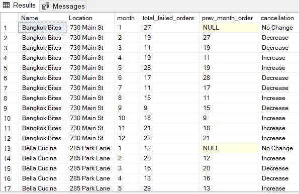

 ```sql
SELECT Name, Location, MONTH(Order_Date) AS month, COUNT(DISTINCT Order_ID) AS total_failed_orders,
       LAG(COUNT(DISTINCT Order_ID), 1) OVER (PARTITION BY Name ORDER BY MONTH(Order_Date)) AS prev_month_order,
       CASE 
         WHEN COUNT(DISTINCT Order_ID) > LAG(COUNT(DISTINCT Order_ID), 1) OVER (PARTITION BY Name ORDER BY MONTH(Order_Date)) THEN 'Increase'
         WHEN COUNT(DISTINCT Order_ID) < LAG(COUNT(DISTINCT Order_ID), 1) OVER (PARTITION BY Name ORDER BY MONTH(Order_Date)) THEN 'Decrease'
         ELSE 'No Change' 
       END AS cancellation
FROM Restaurants r 
LEFT JOIN Orders o ON r.Restaurant_ID = o.Restaurant_ID 
WHERE Status = 'Not Delivered' 
GROUP BY Name, Location, MONTH(Order_Date) 
ORDER BY Name, month;
```

💡 Insight:
- Bangkok Bites saw significant fluctuation as cancellations fell from 27 (Jan) to 11 (Mar), but spiked again in May (28)
- Bella Cucina had a big jump from 12 (Jan) to 20 (Feb), followed by steady improvement

📌 Action Plan:
- Months with increased cancellations may indicate internal issues — out-of-stock items, quality issues, etc. Hence need to monitor operational logs.
- Consistent improvement months (e.g., April–May for Bella Cucina) may reflect successful process optimizations.


### 10. 🚴‍♂️ Average Rider Delivery Time

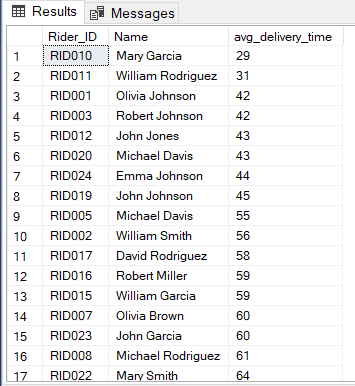

 Riders' average time ranged from **~29–123 mins**.

```sql
SELECT r.Rider_ID, Name, AVG(ABS(DATEDIFF(MINUTE, CAST(Pickup_time AS TIME), CAST(Delivery_Time AS TIME)))) AS avg_delivery_time 
FROM Riders r 
JOIN Deliveries d ON r.Rider_ID = d.Rider_ID 
GROUP BY r.Rider_ID, Name 
ORDER BY avg_delivery_time;
```

💡 Insight:
- Mary Garcia (29 mins) and William Rodriguez (31 mins) are the most efficient
- Mary Smith and Michael Rodriguez took over 60+ mins, making them the slowest
- 2x delivery time variation affects customer experience

📌 Recommendation:
- Consider incentives or bonuses for top riders
- Identify if slower riders are assigned to high-traffic zones or complex deliveries and provide routing assistance or support tools

### 11. 📉 MoM Order Growth (Restaurant-Level)

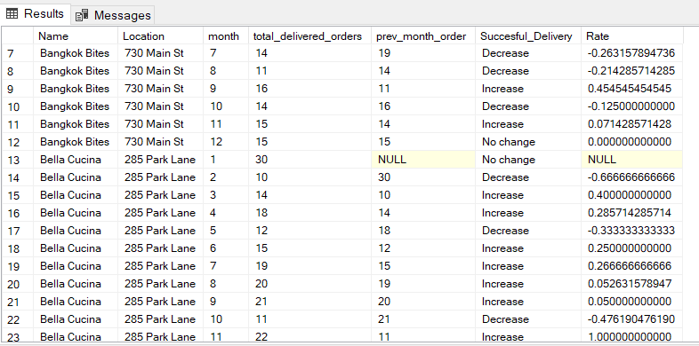

```sql

SELECT Name, Location, MONTH(Order_Date) AS month, COUNT(DISTINCT Order_ID) AS total_delivered_orders,
       LAG(COUNT(DISTINCT Order_ID), 1) OVER(PARTITION BY Name ORDER BY MONTH(Order_Date)) AS prev_month_order,
       CASE 
         WHEN COUNT(DISTINCT Order_ID) > LAG(COUNT(DISTINCT Order_ID), 1) OVER(PARTITION BY Name ORDER BY MONTH(Order_Date)) THEN 'Increase'
         WHEN COUNT(DISTINCT Order_ID) < LAG(COUNT(DISTINCT Order_ID), 1) OVER(PARTITION BY Name ORDER BY MONTH(Order_Date)) THEN 'Decrease'
         ELSE 'No change' 
       END AS Succesful_Delivery,
(COUNT(DISTINCT Order_ID) - LAG(COUNT(DISTINCT Order_ID), 1) OVER(PARTITION BY Name,Location ORDER BY MONTH(Order_Date)))*1.0/LAG(COUNT(DISTINCT Order_ID), 1) OVER(PARTITION BY Name,Location ORDER BY MONTH(Order_Date)) Rate
FROM Restaurants r 
LEFT JOIN Orders o ON r.Restaurant_ID = o.Restaurant_ID 
WHERE Status = 'Delivered' 
GROUP BY Name, Location, MONTH(Order_Date) 
ORDER BY Name, month;
```

💡 Insight:
- 📉 Bangkok Bites – Inconsistent Delivery Trends
    - Experienced 3 consecutive months of decline (July: -26%, Aug: -21%, Oct: -12%)
    - Growth seen in September (+45%) and November (+7%)

📌 Interpretation: Volatile performance suggests external factors (e.g., operational bottlenecks, demand shifts)

✅ Action: Investigate reasons behind volatility like staffing, promotions, quality dips etc.

- 📉 Bella Cucina – Dramatic Early Drop & Strong Recovery
   - Started with a -66% drop in February, then a +40% increase in March
   - Followed by fluctuating growth with smaller gains/losses (April: +28%, May: -33%)
   - Major positive spike in November: +100% growth (from 11 to 22 deliveries)

📌 Interpretation: Possibly implemented successful turn-around strategy—could be new menu items, marketing push, or improved operations.

✅ Action: 
- Analyze internal changes that led to the November jump, replicate across other underperforming branches.
- Month-over-Month Order Growth Analysis and correlate growth trends with customer retention and repeat ordering metrics and suggest loyalty programs for restaurants with stable growth

### 12. 🧱 Customer Segmentation: Gold vs. Silver

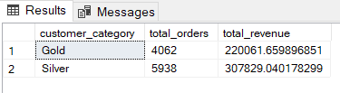

```sql
WITH customer_details AS (
  SELECT c.Customer_ID, Name, AVG(Total_Amount) AS avg_customer_spend, avg_revenue 
  FROM Customer c 
  LEFT JOIN (
    SELECT *, AVG(Total_Amount) OVER(ORDER BY (SELECT NULL)) AS avg_revenue FROM Orders
  ) o ON c.Customer_ID = o.Customer_ID 
  GROUP BY c.Customer_ID, Name, avg_revenue
),
customer_segments AS (
  SELECT Customer_ID, Name,
         CASE WHEN avg_customer_spend > avg_revenue THEN 'Gold' ELSE 'Silver' END AS customer_category 
  FROM customer_details
)
SELECT customer_category, COUNT(DISTINCT Order_ID) AS total_orders, SUM(Total_Amount) AS total_revenue 
FROM customer_segments cs 
JOIN Orders o ON cs.Customer_ID = o.Customer_ID 
GROUP BY customer_category;
```

💡 Insight:
- Silver customers contribute higher overall revenue but have a lower average order value than Gold
- Gold customers are more profitable per order — possibly more loyal or inclined to premium items

✅ Recommndations:
- Upsell Silver customers through personalized deals to increase order value
- Target Silver customers withIncentives for increased spending (e.g., spend $50 more to get Gold)
- Retain Gold customers with loyalty benefits (free delivery, early access to offers, VIP support)
- Invest more in retaining Gold customers and use cost-effective campaigns for Silver users until they move up tiers

### 13. 💵 Rider Earnings

 Formula: `8% of Order Value + Tip`.

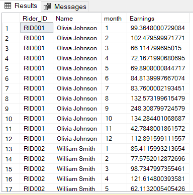

```sql
SELECT r.Rider_ID, Name, MONTH(Order_Date) AS month, SUM((Total_Amount * 0.08) + Tip) AS Earnings 
FROM Riders r 
LEFT JOIN Deliveries d ON r.Rider_ID = d.Rider_ID 
LEFT JOIN Orders o ON d.Order_ID = o.Order_ID 
GROUP BY r.Rider_ID, Name, MONTH(Order_Date) 
ORDER BY r.Rider_ID, Name, MONTH(Order_Date);
```

💡 Insights:
- Monthly earnings ranged from $66 to $248, showing seasonal or performance-based variability
- Peak month: November (₹248)
- William Smith’s (RID002) earnings are less variable, possibly due to consistent performance
- Significant earning spikes suggest bonus or incentive schemes are working
- Can use historical peak months (like November) to plan incentive-driven campaigns and rider staffing

✅ Recommndations:
- Implement performance-based bonuses during high-demand months
- Identify low-earning months and redistribute orders or training accordingly

### 14. ⭐ Rider Rating Simulation
- Based on delivery duration:
  - `<30min`: 5⭐, `30–40`: 4⭐, `41-50`: 3⭐, `51-60`: 2⭐, `>60`: 1⭐, etc.

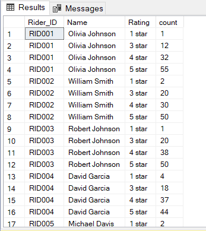

``` sql
WITH ratings AS (
  SELECT r.Rider_ID, Name,
         CASE 
           WHEN ABS(DATEDIFF(MINUTE, CAST(Pickup_time AS TIME), CAST(Delivery_Time AS TIME))) < 30 THEN '5 star'
           WHEN ABS(DATEDIFF(MINUTE, CAST(Pickup_time AS TIME), CAST(Delivery_Time AS TIME))) BETWEEN 30 AND 40 THEN '4 star'
           WHEN ABS(DATEDIFF(MINUTE, CAST(Pickup_time AS TIME), CAST(Delivery_Time AS TIME))) BETWEEN 41 AND 50 THEN '3 star'
           WHEN ABS(DATEDIFF(MINUTE, CAST(Pickup_time AS TIME), CAST(Delivery_Time AS TIME))) BETWEEN 51 AND 60 THEN '2 star'
           ELSE '1 star' 
         END AS Rating 
  FROM Riders r 
  LEFT JOIN Deliveries d ON r.Rider_ID = d.Rider_ID 
  LEFT JOIN Orders o ON d.Order_ID = o.Order_ID 
  WHERE Status = 'Delivered'
)
SELECT Rider_ID, Name, Rating, COUNT(Rating) AS count 
FROM ratings 
GROUP BY Rider_ID, Name, Rating 
ORDER BY Rider_ID, Name;
```

💡 Insights:
- Top 3 riders (Olivia, William, Robert) have the highest 5-star feedback with minimal 1-stars
- Strong correlation between delivery time & ratings (Olivia had 42 mins average delivery, with 55 5-stars).

✅ Recommndations:
- Build a rider leaderboard to showcase high performers
- Offer performance bonuses or incentives for riders consistently rated ⭐⭐⭐⭐ and above
- Use feedback to coach low-rated riders (e.g., David Rodriguez, Michael Davis)
- Introduce a public-facing badge (e.g., “Top Rated Rider 🚴‍♂️”) visible to customers during live tracking
 
### 15. 🗓️ Restaurant Busiest Day

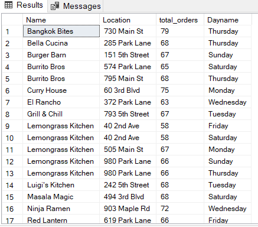

```sql
WITH order_frequency AS (
  SELECT Name, Location, DATENAME(dw, Order_Date) AS Dayname, COUNT(DISTINCT Order_ID) AS total_orders,
         DENSE_RANK() OVER(PARTITION BY Name, Location ORDER BY COUNT(DISTINCT Order_ID) DESC) AS rank 
  FROM Restaurants r 
  JOIN Orders o ON r.Restaurant_ID = o.Restaurant_ID 
  GROUP BY Name, Location, DATENAME(dw, Order_Date)
)
SELECT Name, Location, total_orders,Dayname 
FROM order_frequency 
WHERE rank = 1;
```

💡 Insights:
- Most restaurants show peak order volume on Thursday, Sunday, and Friday
- Bangkok Bites tops the chart with 79 orders on Thursday.
- Several restaurants including Lemongrass Kitchen and Burrito Bros show multiple peak days (Monday, Thursday, Sunday).

✅ Business Actions:
- Optimize staffing and inventory on peak days.
- Run day-specific promotions or discounts (e.g., "Snacking Thursday") to boost average order value (AOV)
- Targeted notifications to customers on peak days for better engagement

### 16. 💰 Customer Lifetime Value

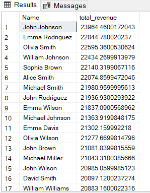

```sql
SELECT Name, SUM(Total_Amount) AS total_revenue 
FROM Customer c 
LEFT JOIN Orders o ON c.Customer_ID = o.Customer_ID 
GROUP BY Name 
ORDER BY total_revenue DESC;
```

💡 Insights:
- John Johnson leads with a lifetime value of over $23,964
- Top 5 high-value customers (John Johnson, Emma Rodriguez, Olivia Smith, William Johnson, Sophia Brown) all have CLTV above $22,000
- These users contribute significantly to total revenue and should be considered VIPs

✅ Business Actions:
- Design a Gold-tier loyalty program for high LTV customers
- Offer exclusive rewards or personalized offers (e.g., cashback, free deliveries)
- Provide AI-driven suggestions based on high CLV users’ past purchases (e.g., cuisine preferences, restaurants, price range)

### 17. 📅 Sales Trends Over Months

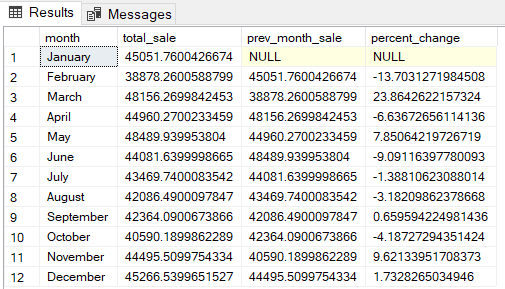

```sql
SELECT DATENAME(month, Order_Date) AS month, SUM(Total_Amount) AS total_sale,
  LAG(SUM(Total_Amount), 1) OVER(ORDER BY MONTH(Order_Date)) AS prev_month_sale,
  (SUM(Total_Amount) - LAG(SUM(Total_Amount), 1) OVER(ORDER BY MONTH(Order_Date))) * 100.0 / 
   LAG(SUM(Total_Amount), 1) OVER(ORDER BY MONTH(Order_Date)) AS percent_change
FROM Orders 
GROUP BY DATENAME(month, Order_Date), MONTH(Order_Date);
```

💡 Insights:
- Sharp drop in February (↓13.70%) followed by strong recovery in March (↑23.86%)
- Sales volatility in April–August; minor fluctuations, indicating seasonal or operational factors
- November shows peak sales ($44,995) and December($45,266) continues with growth

✅ Business Actions:
- Investigate drop in June & February – possibly due to off-season trends or service issues
- Run targeted retention offers or restaurant audits for underperforming months
- Promote campaigns heavily during March, November, December – when customer response is higher
- Allocate ad budgets based on seasonal sales trends (e.g., more spend in months with proven growth)
- Use predictive models to forecast and smoothen sales cycles

### 18. 🏎️ Fastest vs. Slowest Riders

Based on avg. delivery time

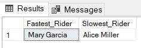

```sql
WITH rider_efficiency AS (
  SELECT 
    Name,
    AVG(ABS(DATEDIFF(MINUTE, CAST(Pickup_time AS TIME), CAST(Delivery_Time AS TIME)))) AS avg_delivery_time,
    DENSE_RANK() OVER (ORDER BY AVG(ABS(DATEDIFF(MINUTE, CAST(Pickup_time AS TIME), CAST(Delivery_Time AS TIME))))) AS rnk
  FROM Riders r
  LEFT JOIN Deliveries d ON r.Rider_ID = d.Rider_ID
  GROUP BY Name
),
rank_bounds AS (
  SELECT 
    MIN(rnk) AS min_rank,
    MAX(rnk) AS max_rank
  FROM rider_efficiency
)
SELECT
  MIN(CASE WHEN re.rnk = rb.min_rank THEN re.Name END) AS Fastest_Rider,
  MIN(CASE WHEN re.rnk = rb.max_rank THEN re.Name END) AS Slowest_Rider
FROM rider_efficiency re
CROSS JOIN rank_bounds rb;
```

### 19. 🌦️ Seasonal Item Popularity

Mapped dish orders across Spring, Summer, Rainy, Winter

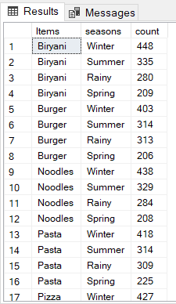

```sql
WITH seasons AS (
  SELECT MONTH(Order_Date) AS month, Order_ID, Items,
         CASE 
           WHEN MONTH(Order_Date) BETWEEN 2 AND 3 THEN 'Spring'
           WHEN MONTH(Order_Date) BETWEEN 4 AND 6 THEN 'Summer'
           WHEN MONTH(Order_Date) BETWEEN 7 AND 9 THEN 'Rainy'
           ELSE 'Winter' 
         END AS seasons 
  FROM Orders
)
SELECT Items, seasons, COUNT(DISTINCT Order_ID) AS count 
FROM seasons 
GROUP BY Items, seasons 
ORDER BY Items, count DESC;
```

💡 Insights: Winter is the peak season for all major food categories

✅ Business Actions:
- Create winter combo menus
- Use targeted marketing for top items like Biryani and Pizza
- Scale inventory and kitchen staff for winter months to handle higher demand
- Allow users to filter by “Winter Favorites”, “Rainy Specials”, etc., improving their browsing and purchase experience
- Integrate seasonal data in sync with regional festivals or events for better cultural targeting and engagement

### 20. 📈 Restaurant Growth Ratio (MoM)

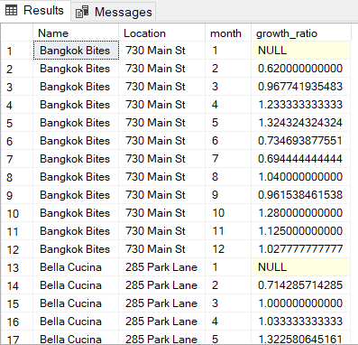

```sql
SELECT Name, Location, MONTH(Order_Date) AS month,
       COUNT(DISTINCT Order_ID) * 1.0 / 
       LAG(COUNT(DISTINCT Order_ID), 1) OVER(PARTITION BY Name, Location ORDER BY MONTH(Order_Date)) AS growth_ratio 
FROM Restaurants r 
LEFT JOIN Orders o ON r.Restaurant_ID = o.Restaurant_ID 
GROUP BY Name, Location, MONTH(Order_Date);
```

💡 Insights:
- Bangkok Bites (730 Main St)
   - Showed consistent positive growth most months
   - Best month: May (1.324) and October (1.28).
   - Weakest month: September (-0.961)
- Bella Cucina (285 Park Lane)
   - Also shows steady growth, with peak performance in May (1.322).
   - Growth slowdown observed in March (1.0).

✅ Business Actions:
- Double down on Bangkok Bites' successful months with promotions
- Investigate September drop – possibly due to seasonal changes or operational issues
- Maintain and reinforce positive growth for Bella Cucina with targeted campaigns in underperforming months
- Integrate MoM growth into the internal restaurant ranking algorithm to surface more dynamic and active restaurants to users
- Optimize Promotions by allocating marketing budget based on growth trends—boost ads for fast-growing restaurants and consider retention strategies for declining ones

## 🛠️ SQL Techniques Used

- **Window Functions**: `LAG()`, `DENSE_RANK()`, `AVG()`, etc.
- **Joins**: `INNER`, `LEFT JOIN` across 5+ tables
- **Aggregates**: `SUM()`, `COUNT()`, `DATEDIFF()`
- **Case Logic**: `CASE WHEN` used for dynamic labels and segmentation
- **Time Functions**: `DATEPART`, `DATENAME`, `MONTH()`, `CAST()`

---

## 🔑 Key Takeaways & Strategic Actions
- High-Lifetime Customers: Create a "Zomato Elite" program for users like John Johnson.
- Red-Flag Restaurants: Investigate top earners with high failed orders (e.g., Sushi Zen).
- Rider Recognition: Promote riders like Mary Garcia & Olivia Johnson as model employees.
- Seasonal Strategy: Launch seasonal favorites to align with item trends.
- Gold vs. Silver Campaigns: Gold = Retention focus | Silver = Upsell strategy.
- Data-Backed Growth Support: Prioritize app visibility for restaurants with positive growth momentum.

---

## 🧾 Conclusion
This Zomato Sales Analysis project showcases the power of SQL in reveling actionable business intelligence from raw transactional data. Through comprehensive analysis across customer behavior, restaurant performance, and delivery efficiency, we were able to:
  - Identify high-value customers and segment them for targeted loyalty strategies
  - Detect restaurant-level trends in growth, revenue, and operational issues
  - Highlight peak order timings, popular items, and seasonal preferences to support marketing decisions
  - Assess rider performance and payout trends to optimize delivery operations

By transforming 20+ analytical queries into strategic insights, this project demonstrates how data-driven decisions can boost revenue, enhance customer satisfaction, and streamline delivery logistics. This analysis provides a strong foundation for dashboarding, predictive modeling, and business expansion planning.


